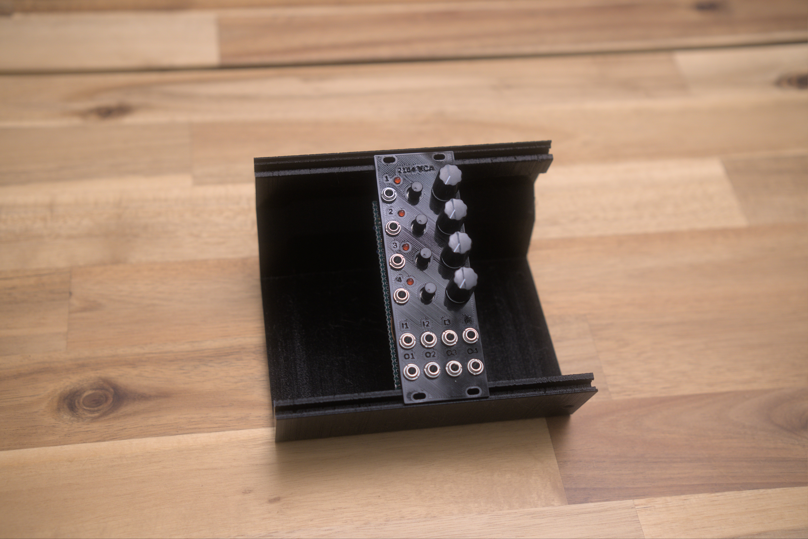
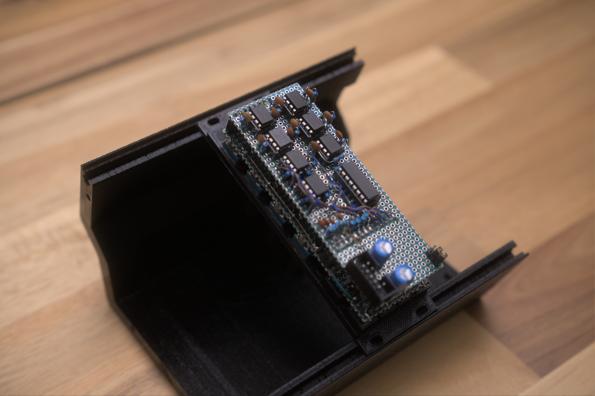
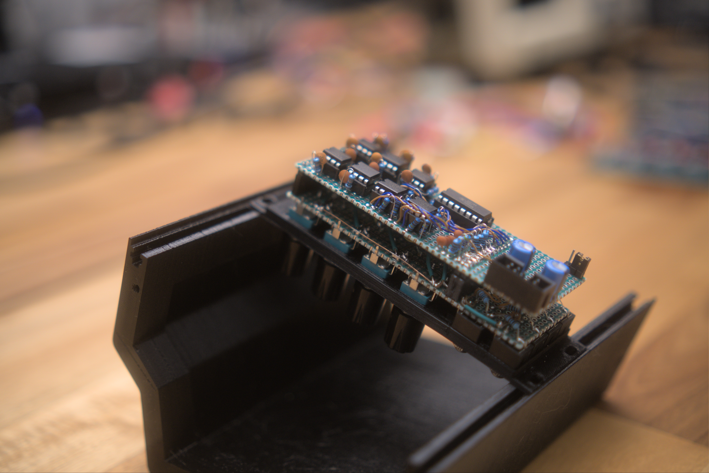
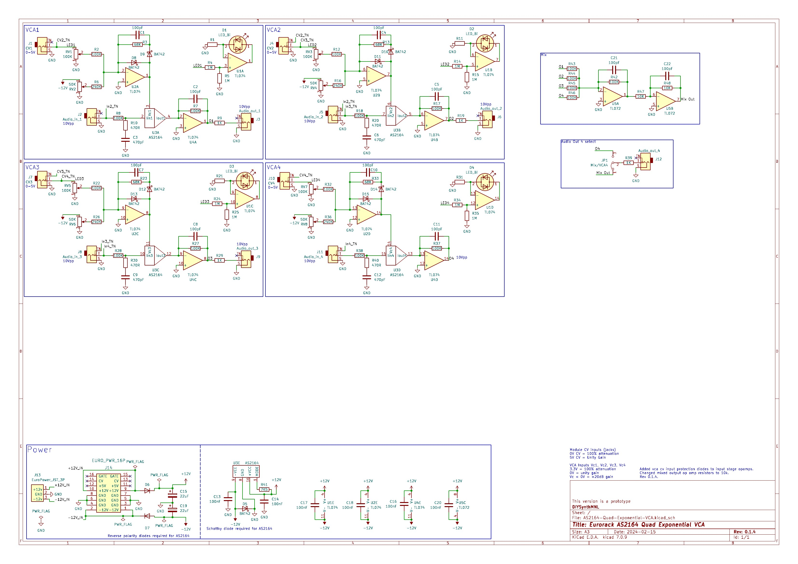

[Module GitHub Repo](https://github.com/DIYSynthMNL/Eurorack-2164-Quad-Exponential-VCA)

## TODO

- [x] Schematic
- [x] Prototype
- [ ] PCB Design

## Introduction

This module is a simple Quad VCA design. The design is based on the chip’s datasheet info.

## Module Images

 

## Demo



## Module Features

Four exponential voltage controlled VCAs.

Each CV input is normalled to the next. CV1>CV2>CV3>CV4
Each Signal input is normalled to the next. IN1>IN2>IN3>IN4

The 4th output jack can be switched to either the 4th VCA output or the mix output using a jumper.

## I/O and Controls

Each VCA channel will have:

- Control voltage input (10vpp)
- Input attenuation knob
- Control (when no cv) / offset knob (when cv signal is present)
- Signal input (audio or CV signals)
- Signal output

## Design Notes

### Designing the cv input circuit

[https://www.analog.com/media/en/technical-documentation/data-sheets/SSM2164.pdf](https://www.analog.com/media/en/technical-documentation/data-sheets/SSM2164.pdf)

Control voltage and gain/attenuation

- Unity gain = 0v control voltage
- -100dB of attenuation = +5v control voltage

With that, a control voltage of 0 to 5v is optimal. We can just invert the input using an inverting op amp.

Another design decision that I would like to add to the module is normalling both cv and audio inputs to the next vca. I1>I2>I3>I4, CV1>CV2>CV3>CV4 when nothing is connected to multiply whatever is connected to the first input.
  

Protection from no negative power supply

### Using the SSI 2164 datasheet CV input circuit

2164 chip voltage and attenuation relationship (Inverse) based on the ssi2164 datasheet

- 3.4V = Mute
- 0V = unity gain
Datasheet circuit
- sums, inverts, attenuates the control voltage input

### Falstad simulation link

[Falstad Link](https://github.com/DIYSynthMNL/Eurorack-2164-Quad-Exponential-VCA/tree/main/falstad)

### Resources

- [http://www.sdiy.org/philgallo/mgbvca.html](http://www.sdiy.org/philgallo/mgbvca.html)
- [https://doepfer.de/a1324.htm](https://doepfer.de/a1324.htm)
- [https://modwiggler.com/forum/viewtopic.php?t=96486](https://modwiggler.com/forum/viewtopic.php?t=96486)
- [http://electronic-sea.net/SSM2164.html](http://electronic-sea.net/SSM2164.html)
- [https://www.amazingsynth.com/parts/ssi2164/ssi2164-datasheet.pdf](https://www.amazingsynth.com/parts/ssi2164/ssi2164-datasheet.pdf)

## Schematic

## Conclusion

If you'd like to build this module, I have provided a 3D printed front panel file in the repo. I used readily available green perfboard. The components should line up with the perfboard's holes. The panel was made using benjiaomodular's [europanelmaker](https://github.com/benjiaomodular/EuroPanelMaker).
