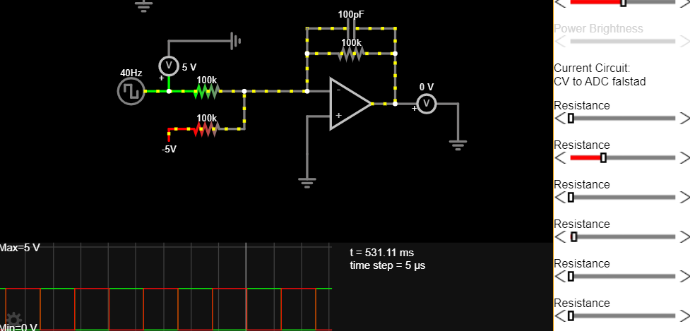
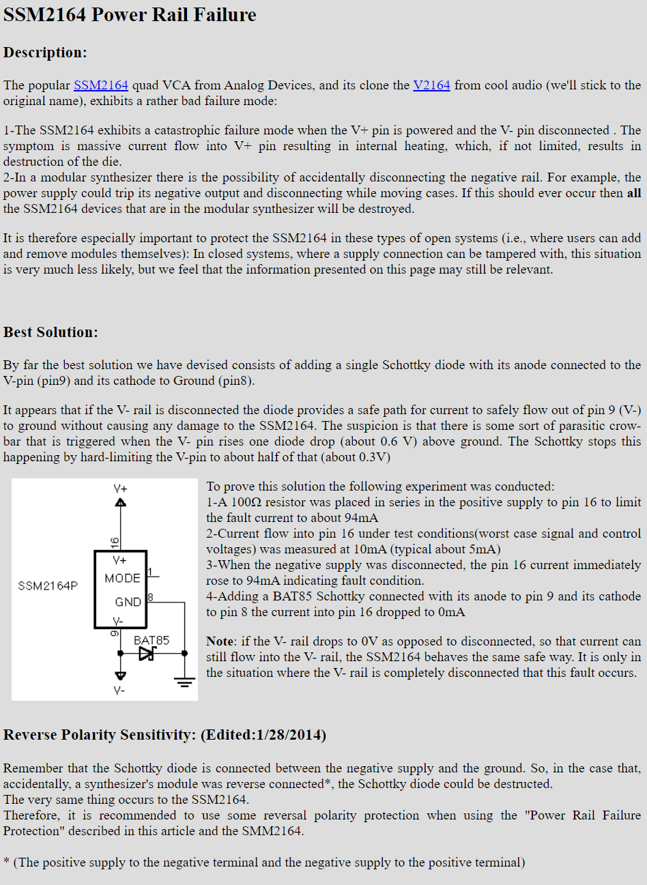
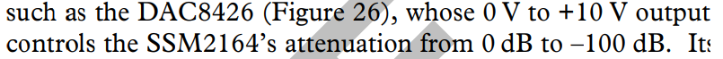
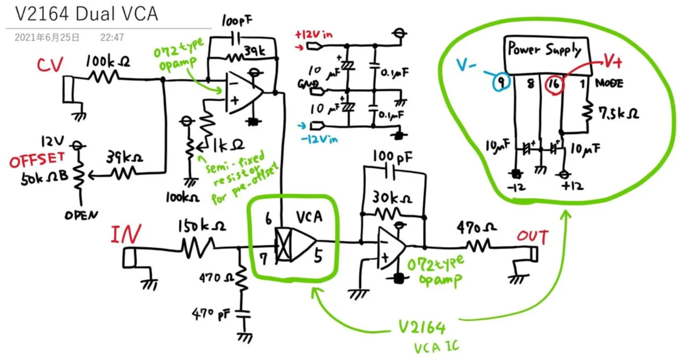
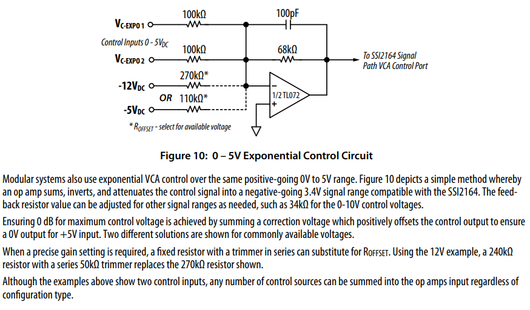

## Designing the cv input circuit

[https://www.analog.com/media/en/technical-documentation/data-sheets/SSM2164.pdf](https://www.analog.com/media/en/technical-documentation/data-sheets/SSM2164.pdf)
  
Control voltage and gain/attenuation

- Unity gain = 0v control voltage
- -100dB of attenuation = +5v control voltage

With that, a control voltage of 0 to 5v is optimal. We can just invert the input using an inverting op amp.

  
Another design decision that I would like to add to the module is normalling both cv and audio inputs to the next vca. I1>I2>I3>I4, CV1>CV2>CV3>CV4 when nothing is connected to multiply whatever is connected to the first input.
  

Protection from no negative power supply

Hagiwo’s design.

## Using the SSI 2164 datasheet CV input circuit

2164 chip voltage and attenuation relationship (Inverse) based on the ssi2164 datasheet

- 3.4V = Mute
- 0V = unity gain
Datasheet circuit
- sums, inverts, attenuates the control voltage input

## Resources

- [http://www.sdiy.org/philgallo/mgbvca.html](http://www.sdiy.org/philgallo/mgbvca.html)
- [https://doepfer.de/a1324.htm](https://doepfer.de/a1324.htm)
- [https://modwiggler.com/forum/viewtopic.php?t=96486](https://modwiggler.com/forum/viewtopic.php?t=96486)
- [http://electronic-sea.net/SSM2164.html](http://electronic-sea.net/SSM2164.html)
- [https://www.amazingsynth.com/parts/ssi2164/ssi2164-datasheet.pdf](https://www.amazingsynth.com/parts/ssi2164/ssi2164-datasheet.pdf)
