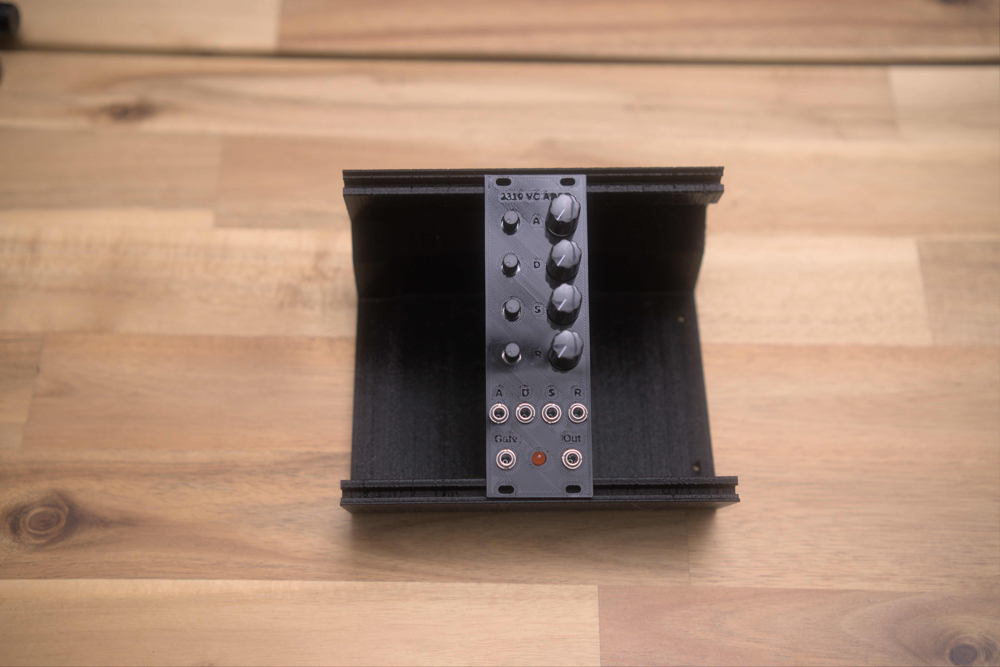
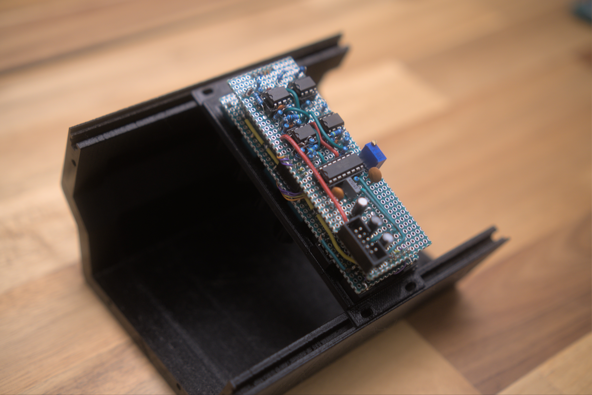
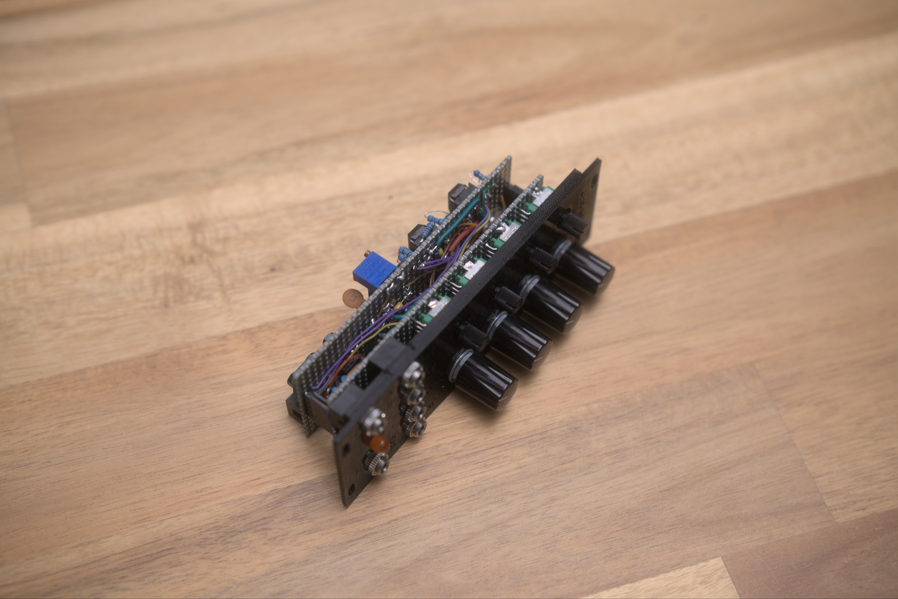
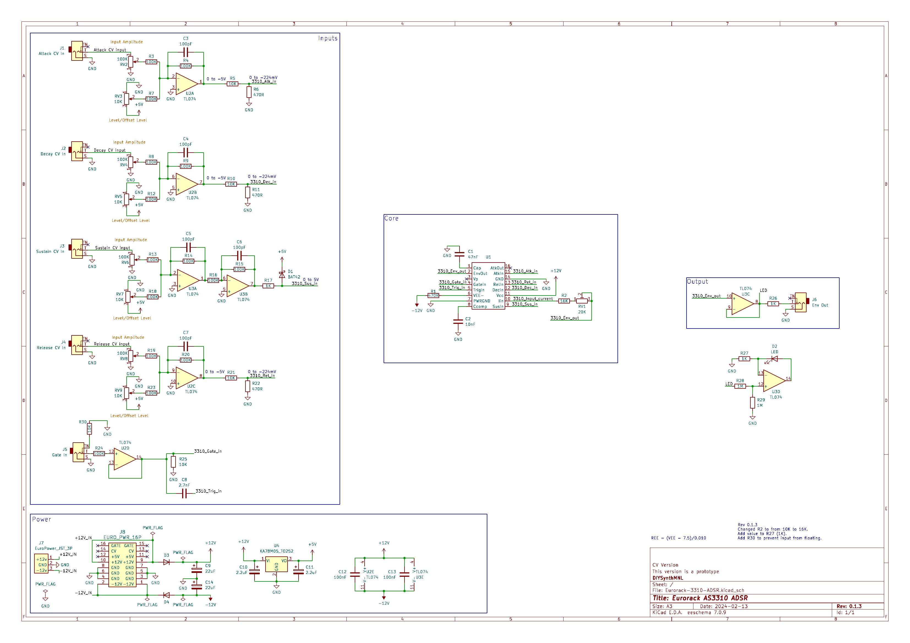

[Module GitHub Link](https://github.com/DIYSynthMNL/Eurorack-3310-ADSR)

This module is licensed under the [MIT License](https://opensource.org/licenses/MIT)

## TODO

- [x] Schematic
- [x] Build prototype
- [ ] PCB Design

## Introduction

This module is a simple VC ADSR design. The design is based on the chip's datasheet info.

## Module Images

 

## Demo



## Module Features

Each envelope parameter is CV controllable (Attack, Decay, Sustain, Release)

## I/O and Controls

Inputs:

- Gate input (0-5v, 0-10v)
- Attack CV input (10vpp)
- Decay CV input (10vpp)
- Sustain CV input (10vpp)
- Release CV input (10vpp)

Output:

- Envelope output (0-5v)

Controls (knobs):

- Attack input attenuation knob
- Attack offset knob (serves as control knob when no input is connected)

- Decay input attenuation knob
- Decay offset knob (serves as control knob when no input is connected)

- Sustain input attenuation knob
- Sustain offset knob (serves as control knob when no input is connected)

- Release input attenuation knob
- Release offset knob (serves as control knob when no input is connected)

## Design Notes

The Attack, Decay, and Release CV inputs are inverting mixers.

The sustain circuit is a combination of an inverting mixer and an inverting amp with a gain of 1 to invert it back in phase. A schottky diode clamps the positive voltage to +5v.

Check out the falstad circuit simulation [here](https://github.com/DIYSynthMNL/Eurorack-3310-ADSR/blob/main/falstad/ADSR_CV_Circuit)

## Schematic

## Conclusion

If you'd like to build this module, I have provided a 3D printed front panel file in the repo. I used readily available green perfboard. The components should line up with the perfboard's holes. The panel was made using benjiaomodular's [europanelmaker](https://github.com/benjiaomodular/EuroPanelMaker).
