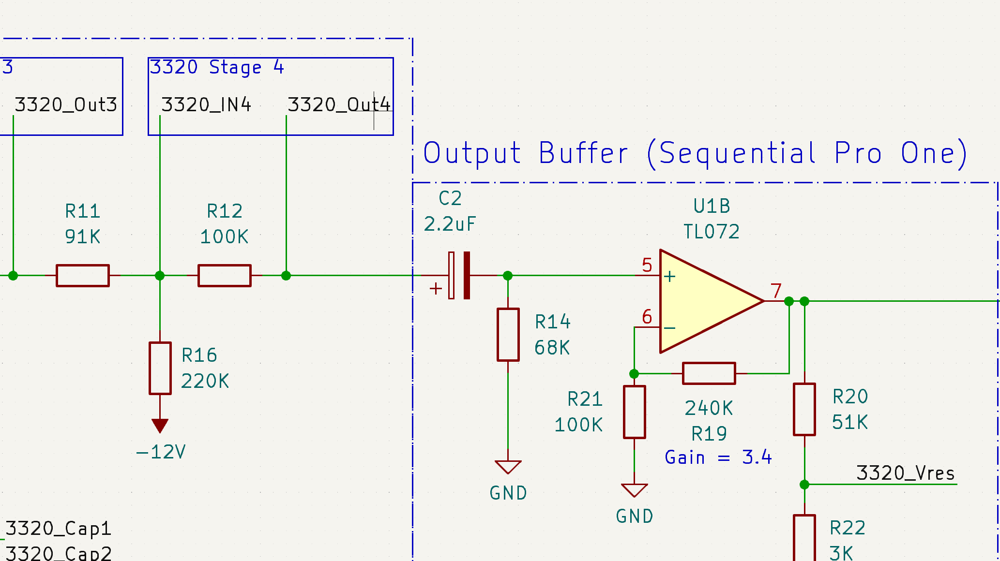

## Resources

- [https://www.eddybergman.com/2020/03/synthesizer-build-part-23-digisound-80.html](https://www.eddybergman.com/2020/03/synthesizer-build-part-23-digisound-80.html)
- V3320 datasheet from cool audio
- AS3320 datasheet
- Hagiwo’s circuit
- [https://electricdruid.net/multimode-filters-part-1-reconfigurable-filters/](https://electricdruid.net/multimode-filters-part-1-reconfigurable-filters/)

## Reddit help question

Eurorack 3320 Low Pass VCF Design Help Needed: Electrolytics for AC Coupling? And some other design questions.

Hi there! I’m designing a Eurorack 3320 LP VCF based on the AS3320 chips I got from Electric Druid. I’ve tried my best to research before asking here but I came up sort of knowledge. I’d like to ask for your help! I’ve got a small quantity of these AS chips and I want to build them into Eurorack modules as correct as possible.
The datasheet for the 3320 uses an electrolytic cap on its output. I’ve read that there are downsides when using (polarized capacitors) [electrolytics for AC coupling](https://northcoastsynthesis.com/news/electrolytics-for-ac-coupling/).
One suggestion that the article said is this: “Use two polarized electrolytic capacitors back to back, with or without some kind of DC bias applied to the centre, or parallel diodes that attempt to limit reverse voltage.”
I’m not quite sure what’s the best way to handle this.
[My current schematic](https://github.com/DIYSynthMNL/Eurorack-3320-VCF/blob/main/Schematic%20PDFs/3320-VCF-Schematic-Rev0.1.0.pdf) applying the two polarized capacitors back to back.
Some other questions that popped up in my head:

1. Based on the datasheet circuit, the output of the 3320 is DC (0V to VCC*0.43)?
2. Should the 3320’s audio input be AC coupled as well?
3. What voltages does the 3320 expect at its audio inputs?
4. Circuits I saw online have inverting buffers before the 3320’s audio input. Why is this necessary? Why invert them?
  
I appreciate the help!

u/halifax's reply:

1. The datasheet shows an output DC offset of between 5 V to 9 V with a typical value of 6.5 V with +-15V supply and 0 V input.
2. I haven't seen AC coupling on the Mutable Ripples or Befaco BF-22. It seems that the common practice is to not AC couple for general inputs in Eurorack low pass filters.
3. The 3320 input is basically an Operational Transconductance Amplifier (OTA) which has a current input. Pin 1 is basically at ground. There is a hard current limit on the chip of 40mA for any pin. With the 91k input resistor and assuming a +-5V VCO input you get a really small current of around +- 0.055 mA.
4. Generally you want to keep your pass band (e.g. the part below the cutoff of a low pass) to be in phase with your original signal. If you are looking at snippets of some larger schematic there may be an inverting stage upstream that they are inverting back from. Something like an inverting mixer that combines a few signals that needs to be inverted back again so that the output is in phase with the input signal.
On your schematic I would only include the AC coupling before the Pro-one output buffer and since you know that it's positively biased you don't need the back-to-back caps. The feedback signal needs to be AC coupled. I would skip the inverter input, input AC coupling and change the output inverter to a buffer and get rid of that AC coupling since that is handled in the previous stage.
