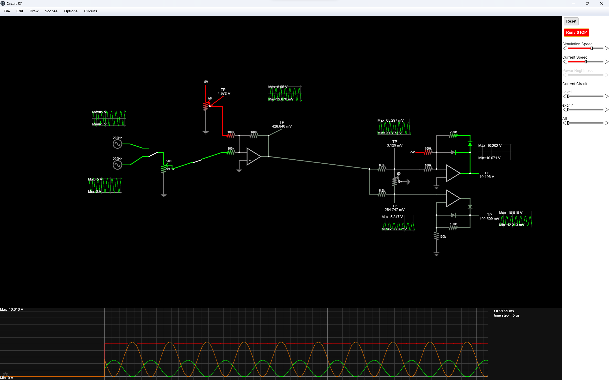
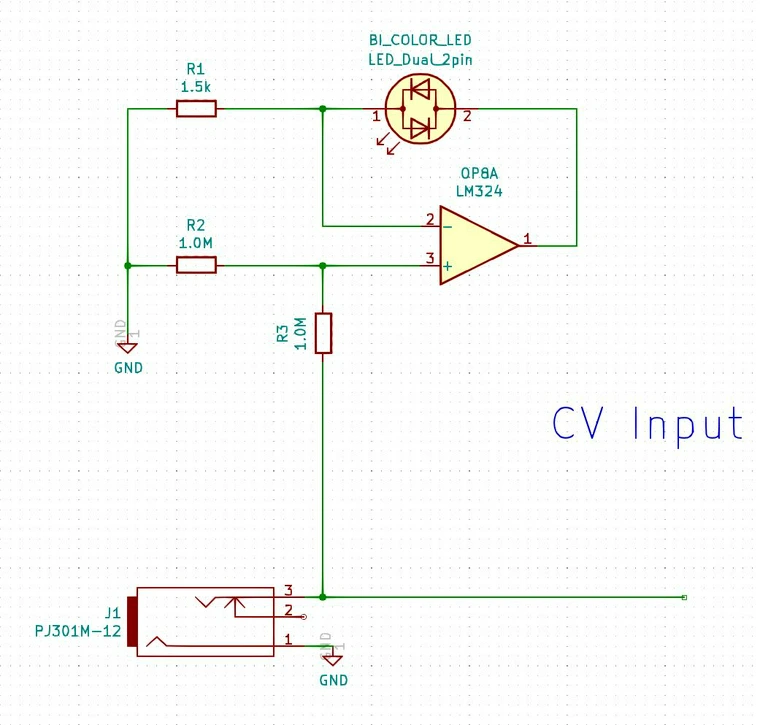

## Some background

The AS3330 is a dual linear/exponential VCA.
The Eurorack module should perform as follows:

- 10Vpp signal inputs
- 10Vpp signal outputs
- Designed to be used with envelope generators or LFOs
  - Ranging from 0V-5V, 0V-10V, and 10Vpp CV signals

## Datasheet and Digisound 80-9 Circuit Design

Refer to the datasheet diagram which I have drawn for the commentary below. I took some explanations from the Digisound 80-9 module documentation. The Digisound 80-9 has nice explanations on how the 3330 chip works. I’ve used ohms law and voltage divider calculators to make sense of the datasheet electrical characteristics and circuit.

### Signal inputs

- pin 4 and 13
- 10Vpp
- A current input
- A summing node
  - Uses 100K resistors to convert an input voltage into an input current
- The Digisound 80-9 circuit added compensation resistor and cap. And a diode to prevent latch up problems.

### Signal outputs

- pin 1 and 16
- should be 10Vpp
- A current output
  - Uses a transimpedance amplifier configuration to convert output current into output voltage
    - If the output is lower or higher than 10Vpp I will experiment with the 51K feedback resistor
    - Based on the Digisound circuit. The 51K resistor sets the maximum gain to 0.4.
    - I used a 100K resistor for the feedback resistor to get the same voltage output from the input.

### Control voltage inputs

- Linear inputs
  - pin 7 and 12
  - 0 to 10V based on the datasheet circuit (through the resistor)
    - 0V = max attenuation
    - 10V = unity gain
  - Icl = 100uA at 10V through the 100K resistor
  - A current input
    - The 100K resistor converts the input voltage into an input current
  - A summing node
    - Would be able to add more control inputs like AM (Digisound 80-9) through a resistor
  - A compensation capacitor connected to the VG pin prevents the log converter from oscillating when the gain of the linear control input is below -80dB (Digisound 80-9)
    - 1nF or larger
  - The input must be normalled to VCC through a jack in order to use one of the other (linear or exponential). If one is zero, the gain will be zero regardless of the voltage on the other (Digisound 80-9)
- Exponential inputs
  - pin 6 and 14
  - -1V to 10V based on the datasheet circuit (through the resistor divider)
    - 0V = unity gain
    - 10V = max attenuation
  - A voltage input (unverified)
    - A voltage divider brings down the input voltage (33K and 1K).
      - @10V, Vce would be 294.12 mV
  - Based on the Digisound circuit. The exponential input should be inverted first to increase gain by increasing the control voltage. A 0V input should mute the signal, and a 10V input should be at unity gain. That would give you another summing node so that you can add more control inputs through resistors.
  - The input must be normalled to VCC through a jack in order to use one of the other (linear or exponential). If one is zero, the gain will be zero regardless of the voltage on the other (Digisound 80-9)

### Gain inputs

- pin 2 and 15
- Based on the datasheet circuit, a resistor is connected to VCC to provide a reference current. A 100uA reference current is implied.
  - RB = 150K at +15V
  - RB = 120K at +12V
- 100uA produces good scale accuracy (Digisound 80-9)

### Distortion trim input

- pin 3 and 17
- I currently don’t see any information on the datasheet. It’s just connected to ground.
- In the Digisound 80-9 documentation, it uses a trimmer. Said to reduce distortion. Feedthrough would be affected though as it was said. I’m not really familiar with feedthrough yet.

### IDLE input

- pin 8
- Variable operating characteristics. Class A to Class B.
- A 6.8K resistor would set it to Class AB (datasheet)
- A 68K resistor would set it to Class A (datasheet)
- A 767K resistor would set it to Class B (datasheet)
- Good balance between distortion, bandwidth and control voltage feedthrough (Digisound 80-9)

### Power inputs

- VCC+
  - Max +18V in relation to GND
  - +12V is safe
- VEE-
  - Max -6V in relation to GND
  - Current limiting resistor required for VEE voltages greater than -6V
    - Based on the datasheet
      - At -15V with a resistor of 680R, the current would be 22mA
      - So for -12V we could aim less than or equal to 22mA (ohms law calculation)
        - I think a 560R resistor would be ok (21.4mA)
  - Can use a -5V regulator with no current limiting resistors needed

## Resources

- [https://electro-music.com/forum/phpbb-files/203_006_vca3330_schematic_119.pdf](https://electro-music.com/forum/phpbb-files/203_006_vca3330_schematic_119.pdf)
- Digisound 80-9
- [http://www.geofex.com/Article_Folders/panner.pdf](http://www.geofex.com/Article_Folders/panner.pdf)
- [https://www.analog.com/media/en/technical-documentation/application-notes/an148fa.pdf](https://www.analog.com/media/en/technical-documentation/application-notes/an148fa.pdf)

## Circuit Design

### Design inspiration

I took some inspiration from Intelligel’s Quad VCA module. It features four VCAs that can have a linear or exponential response. Its response can be tuned to anything in between linear and exponential. The level knob controls the CV offset so that you could use a wide range of voltage signals - bipolar or unipolar. The CV input can also be attenuated using a knob.
  

