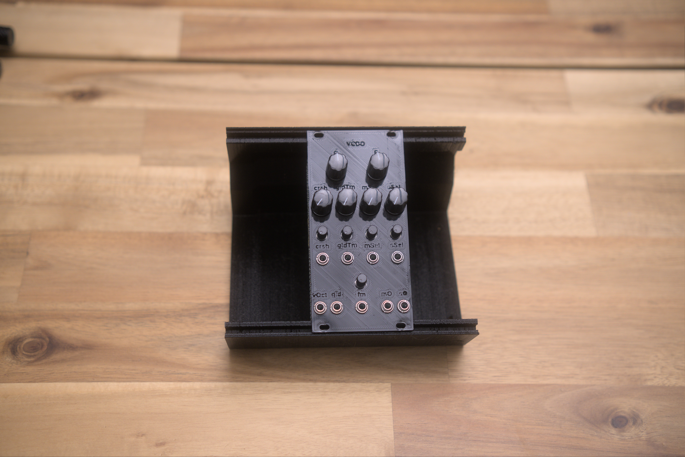
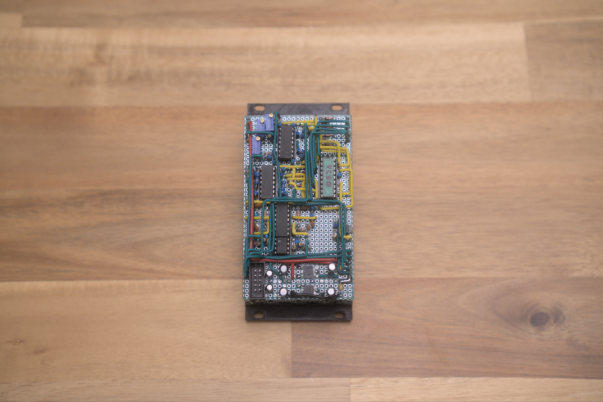
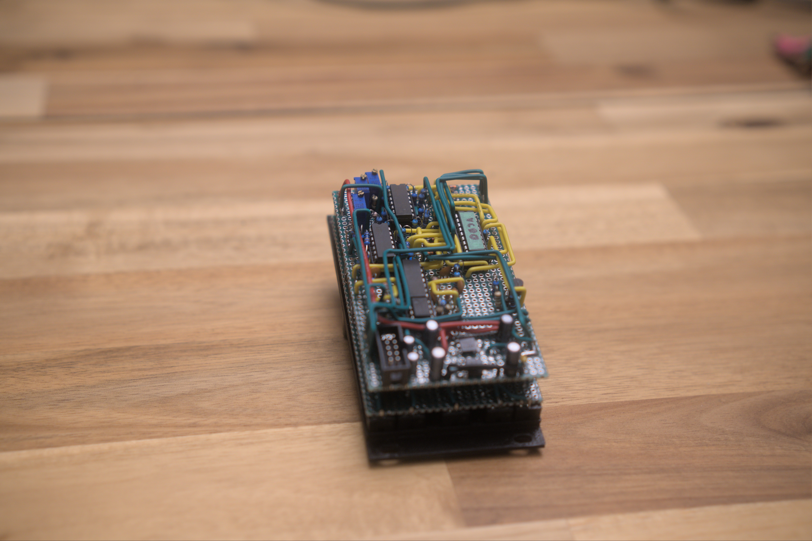
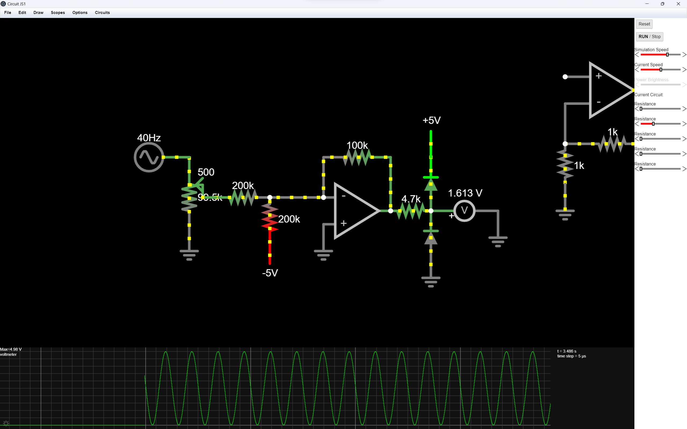
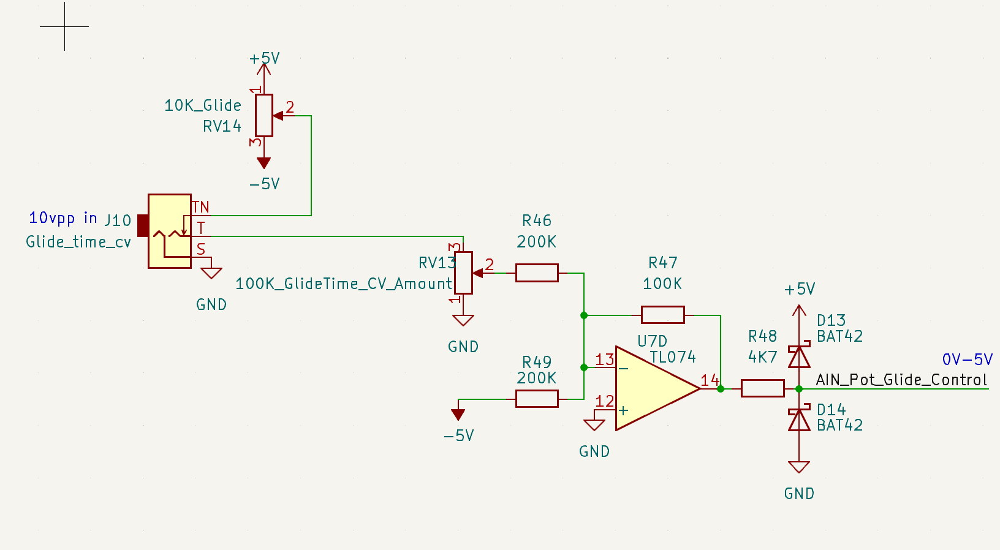
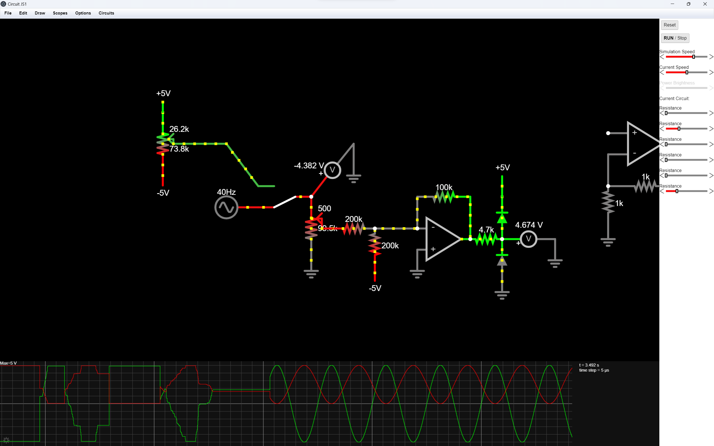
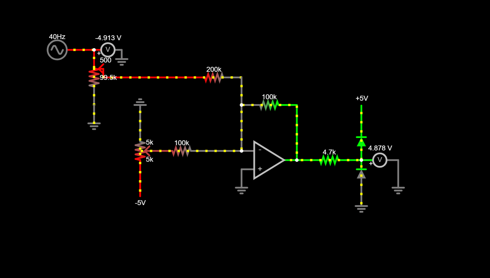
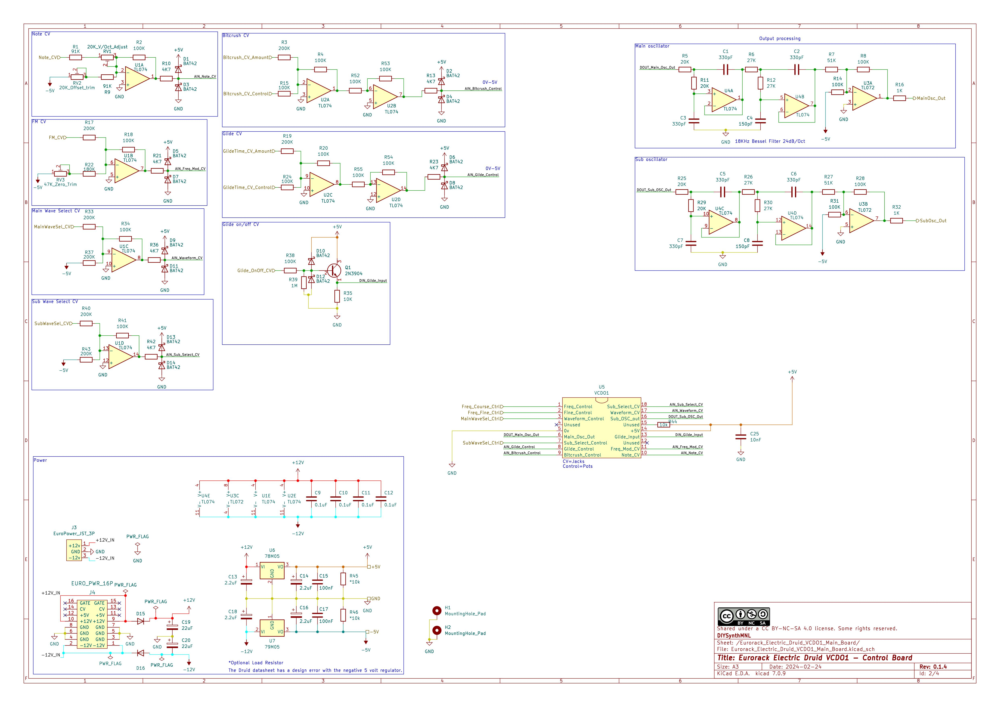
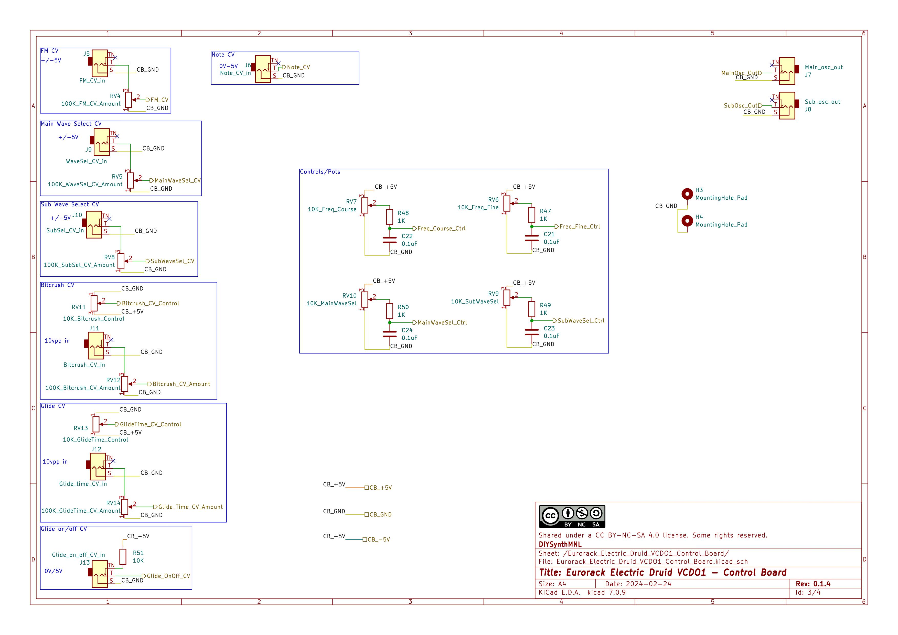

[Module GitHub Link](https://github.com/DIYSynthMNL/Eurorack-Electric-Druid-VCDO1)

This module is shared under a [Creative Commons Attribution-NonCommercial-ShareAlike 4.0 International license](https://creativecommons.org/licenses/by-nc-sa/4.0/). All credits go to Tom Wiltshire, founder of Electric Druid.

## TODO

- [x] Draw schematic based on the datasheet
- [x] Determine if the regulators need load resistors, I’ll put it in just in case
- [x] Try to change the CV input op amps to MCP6004 compare both TL074 will suffice
- [x] Add bitcrush CV in
- [x] Add glide CV in
- [x] Try circuit on breadboard
- [x] Build prototype
- [ ] Fix prototype glitching issues
- [ ] Add 100nF cap to pin 10 to ground to clear up glitch issues
- [ ] Add a 220uF from pin 17 to ground to clear up glitching issues
- [ ] Design PCB

## Introduction

I bought one of these chips from Electric Druid. It sounds awesome! This module is my adaptation of the circuit in [Electric Druid's VCDO chip Datasheet](https://electricdruid.net/wp-content/uploads/2015/07/VCDO-Datasheet.pdf) (p5-8). If you'd like to build one yourself, please buy the chip from Electric Druid to support their work. Otherwise, you can program your own PIC chip but you must use it for non-commercial applications.

Take a look at these other resources from Electric Druid:

- [VCDO page](https://electricdruid.net/voltage-controlled-digital-oscillator-vcdo1/)
- [VCDO shop page](https://electricdruid.net/product/vcdo-wavetable-oscillator/)

## Module Features

- 2 Oscillators
- Main Wavetable Oscillator - smooth transition between 16 waves
- A sub oscillator - incremental transition between 8 sub waves (+1 octave, unison, -1 octave, -2 octaves)
- Has wave bitcrush (can be reduced from 8bit to 1bit) and glide (portamento)

## Module I/O and Controls

Inputs and outputs
Inputs

- Note CV (0v to 5v)
- FM (10vpp)
- Main wave select (10vpp)
- Sub wave select (10vpp)
- Bitcrush amount (10vpp)
- Glide time amount (10vpp)
- Glide on/off (0v to 5v)

From top to bottom, left to right:

### Tuning knobs

1. Course tuning knob
2. Fine tuning knob

### Control Knobs

1. Bitcrush control knob
2. Glide time control knob
3. Main oscillator wave select control knob
4. Sub oscillator wave select control knob

### Input attenuation knobs

1. Bitcrush cv input attenuation knob
2. Glide time cv input attenuation knob
3. Main oscillator wave select cv input attenuation knob
4. Sub oscillator wave select cv input attenuation knob

### CV inputs (10Vpp, -5v to 5v)

1. Bitcrush CV input
2. Glide time CV input
3. Main oscillator wave select CV input
4. Sub oscillator wave select CV input

### IO at the bottom row

1. vOct input (0v to 5v, quantised to chromatic scale, from note 0 to 63)
2. Glide on/off input (0v to 5v)
3. FM input with attenuation knob (10vpp)
4. Main oscillator output (10vpp)
5. Sub oscillator output (10vpp)

## Design Notes

### Adding CV to bitcrush and glide

The circuit below converts 10vpp +/-5v to 0-5v using a TL074 op amp

The circuit below does the following. When you plug in a 10vpp signal, it will bypass RV14, the control pot. When there is nothing plugged in, you can control the parameter using the potentiometer.

  
The screenshot below is a simulation of the circuit above.

  
- [x] Take a look at the circuit from Electric Druid’s LFO. We wouldn't need the circuit above.
  
A much better circuit for glide and bitcrush

## Schematic

## Conclusion

The prototype I built is one of the most intricate prototype builds I've done. It still has a glitching pitch issue so be careful in building your own module. Be sure to read the comments in the Electric Druid project page.

You can build your own module using my 3D printed panel (designed using benjiaomodular's [EuroPanelMaker](https://github.com/benjiaomodular/EuroPanelMaker)) I tweaked the placement of the IO and controls so they line up with a generic protoboard. You have to cut the protoboard to size using my prefferred method - scoring using a blade.

Don't hesitate to contact me on my socials if you have any questions or comments about the module!
