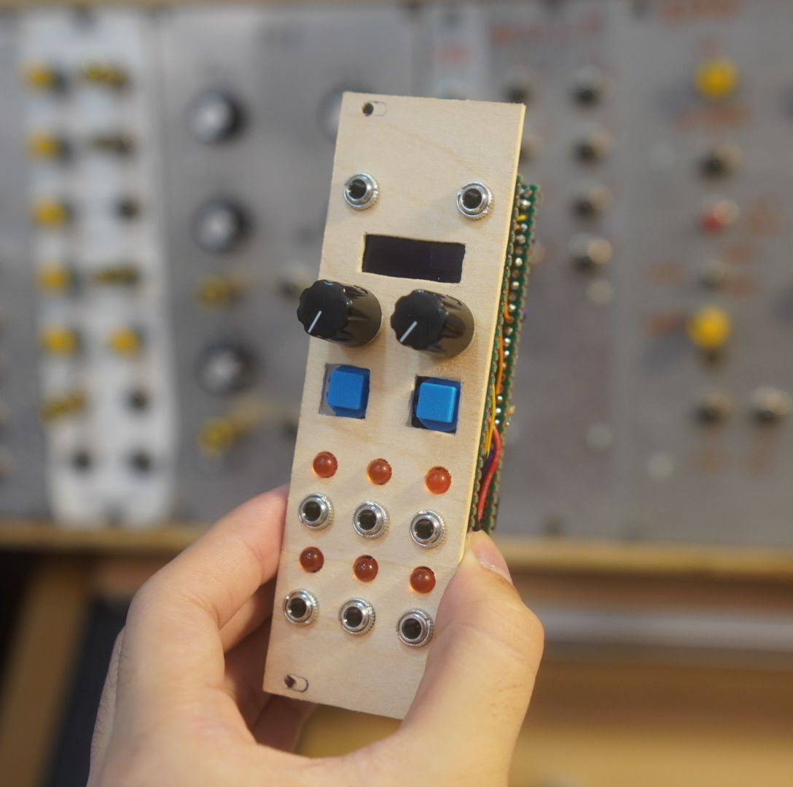
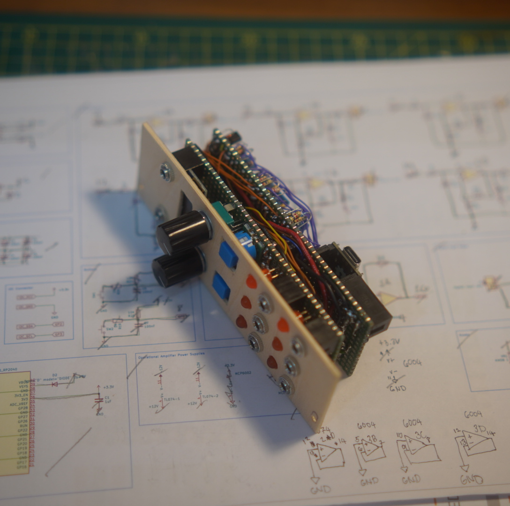
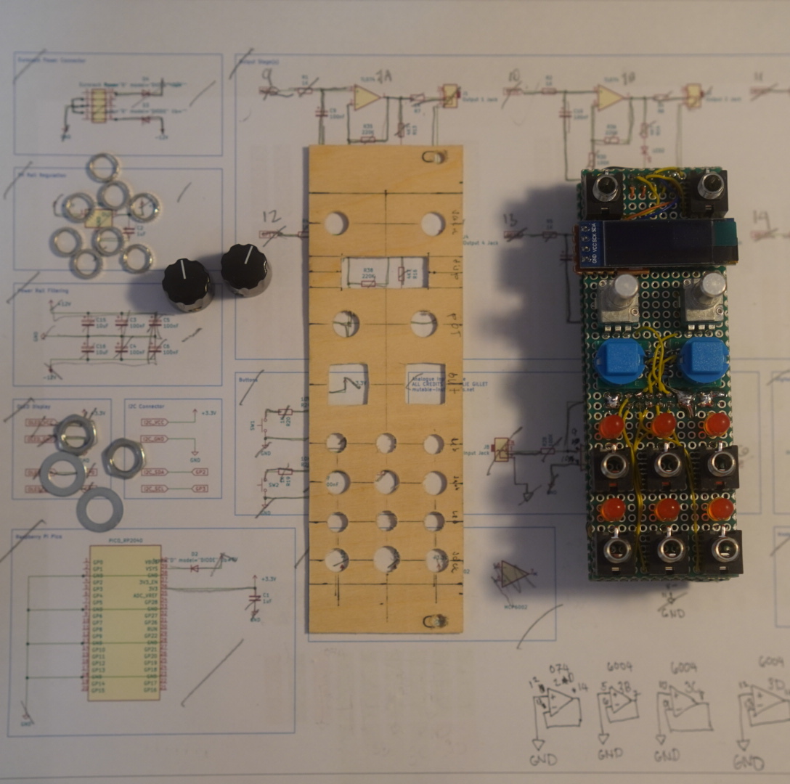
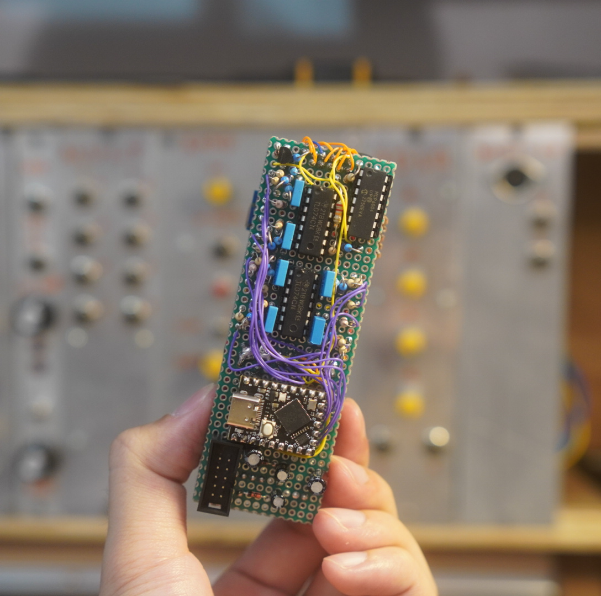
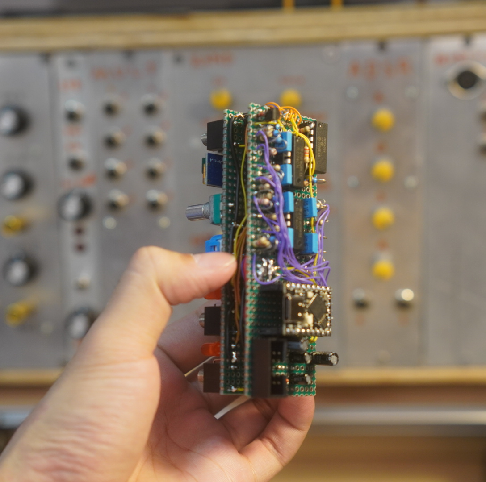
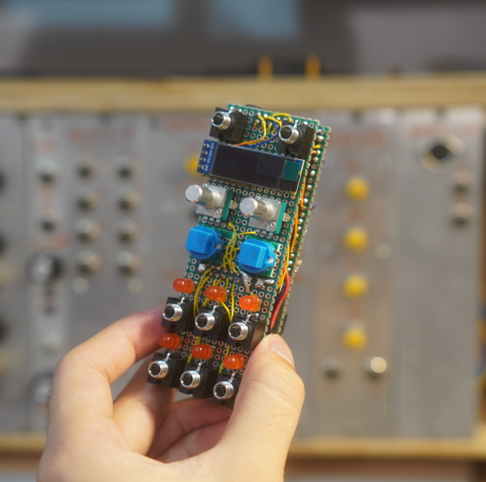
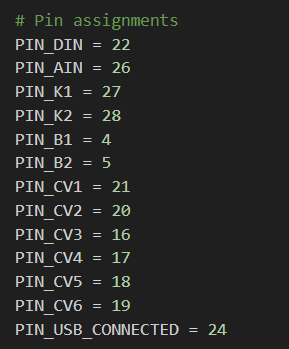
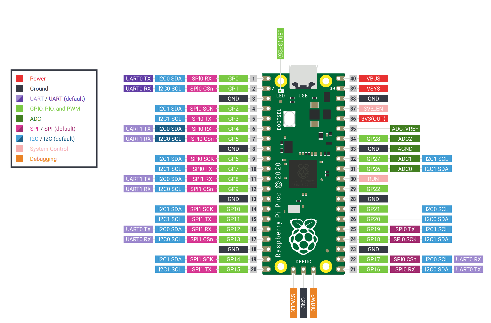
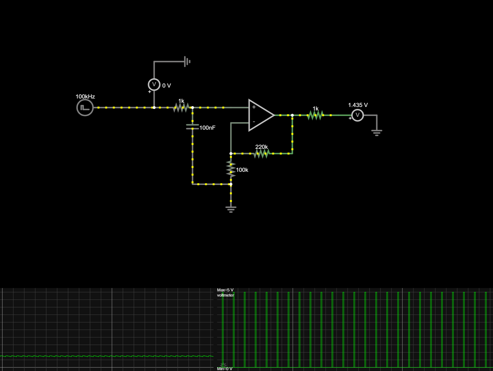

 

   

## Programming the EuroPi

[https://github.com/Allen-Synthesis/EuroPi/blob/main/software/programming_instructions.md](https://github.com/Allen-Synthesis/EuroPi/blob/main/software/programming_instructions.md)

## Using the smaller version of the Pi Pico

### Change pins on europi.py



- I2C OLED pins 0, 1
- Extra I2C pins 2, 3

```Python
# Pin assignments
PIN_DIN = 22
PIN_AIN = 26
PIN_K1 = 27
PIN_K2 = 28
PIN_B1 = 4
PIN_B2 = 5
PIN_CV1 = 21
PIN_CV2 = 20
PIN_CV3 = 16
PIN_CV4 = 17
PIN_CV5 = 18
PIN_CV6 = 19
PIN_USB_CONNECTED = 24
```

### Original Pi Pico Pinouts



### Pi Pico Super Mini pinout


### Edited europi.py pin assignments for Pi Pico Super Mini (to test)

```Python
# Pin assignments
PIN_DIN = 6
PIN_AIN = 26
PIN_K1 = 27
PIN_K2 = 28
PIN_B1 = 7
PIN_B2 = 8
PIN_CV1 = 9
PIN_CV2 = 10
PIN_CV3 = 11
PIN_CV4 = 12
PIN_CV5 = 13
PIN_CV6 = 14
PIN_USB_CONNECTED = 24
```

#### OLED

- SDA - GP0
- SCL - GP1

#### Extra I2C pins

- Extra I2C 2, 3

## How does the outputs work?



How I understand it:

- The Pi Pico outputs a 100kHz PWM pulse
- The output circuit filters the pulses like a DAC would do it using an RC filter.
- When the pulse width is low (0%) the voltage is low
- When the pulse width is high (100%) the voltage is high

## MCP6004 Pinout

VDD = POSITIVE, 5v
VSS = NEGATIVE, 0v or GND
