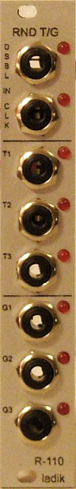
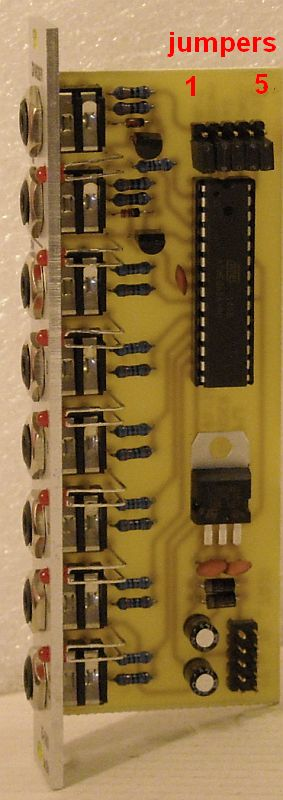
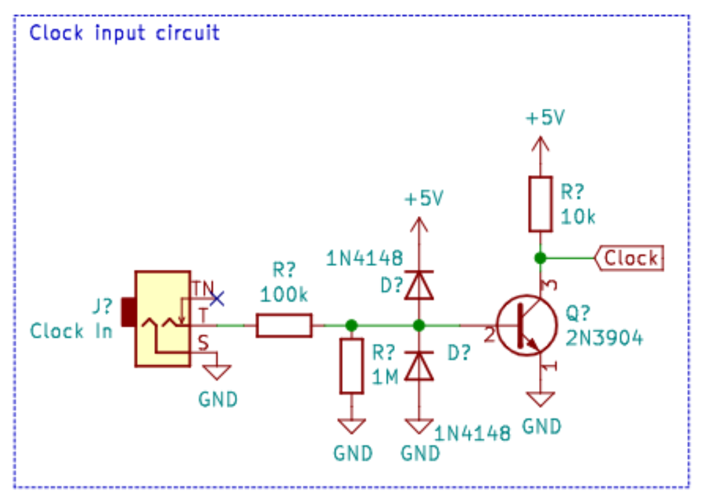

## Idea

I stumbled upon a video that relies on this clocked random trigger/gates module from State Azure.



Here’s his patch notes:

Main clock from Pamela's New Workout, into Ladik R-110 for the random trigs/gates which are essential to this patch.
(Synth voice - Plaits)Trig 1 goes through a Ladik S-090 Skipper at around 60%, which also is being CV modulated via Modbox with a very slow LFO. Trig 1 is then sent to Sinfonion Arp Clock input, which is also copied out to Delta V envelope generator slow atk/decay (decay modulated gently via one of Ochd's outputs). This envelope controls Plaits output via the built into VCA in Delta V. Sinfonion Arp 1v/Oct Out goes into Plaits (arp set to either random or Brownian). Plaits Timbre is modulated via URA A-Out, Harm by B-Out, and Morph by another channel of Ochd. Plaits also receives fast sine LFO FM for vibrato. Plaits then goes through Belgrad, with v/oct modulated by second channel of Delta V 50%atk, 50%dcy (same Trig 1 activates it), which is also copied to Ochd CV input to modulated Ochd speed everytime the envelope is triggered. Belgrad set to 6th filter, FM on, 60% resonance. Span modulated via slow LFO of Ochd, and FM modulated by fast LFO of Ochd.
(Vangelis lead - 4ms Ensemble) Gate1 from Ladik R-110 into Skipper set around 50% (CV modulated) via slow LFO from Modbox. Output from Skipper goes to Quadigy channel 1 and copied to Trig input on RndStep, copied again to Time Warp Gate input. Quadigy Ch.1 Envelope to Tallin linear input, slow attack/decay. Input into Tallin 4ms Ensemble Out B, Balance set to 70%, Twist, Warp and Cross FM all at 0%. Twist opens up via Ch.2 of Quadigy which is tied to Ch.1's trigger, and also has a slow atk/decay for the synth swell. RndStep Bipolar output (attentuated) goes to Ch.3 on Sinfonion, with Ch.3 Sin output going into Time Warp (for Slew), out from Time Warp into 4ms Ensemble 1v/oct input.
(Chainsaw Bass) Ch.1 Output from Sinfonion provides notes, into Chainsaw 1v/oct input. Chainsaw then into Freak filter (Steiner-Parker model), cutoff modulated via Ch. 4 of Quadigy which is triggered by PNW very slow/divided pulse into Skipper.
(Chainsaw 2-note chords) Sinfonion chord Out 1 and Out 3 to second Chainsaw, then out to dual Cinnamon filters set to low-pass, with soft/slow LFO over cutoff via Batumi.
(Sinfonion Key Change) Sinfonion song set to just two steps = E7 to A Major. In1 on Sinfonion set to advance through steps via Trig. Trig comes from PNW slow/heavily divided gate into another Skipper, then to Sinfonion.
Lubadh plays back improvised recording from the Wavestate.
  
## Here’s the module’s details

R-110 “Random clocked trigs/gates w. disable input” module for eurorack / Doepfer A100 system.

 

From top to bottom:

- Disable input jack + LED (if active, gate outputs stays in its current state or are all switched off – selectable by internal jumper)

- Clock input jack + LED

- Trig 1/2/3 output jacks and LEDs (probability = 1/3 so in average every third input clock makes output trigger)

- Gate 1/2/3 output jacks and LEDs (probability = 1/3 so in average every third clock toggles output)

- If there will be say 300 input clocks every trig output makes around 100 trigs. All outputs has same probability but they are independently evaluated (so they can fire together sometimes or individually sometimes).

- Gates are processed similar way but there is “probability of change state”, if clock is evaluated as “valid” to change output state then output toggles (if currently is off then becomes on and vice versa) making gates “quantized” by their lengths to input clocks (gates starts and ends at clocks).

**Configurable parameters** (by internal jumpers, just one of first five should be set):

1. **jumper 1**: fixed **1ms** trig outputs

2. **jumper 2**: fixed **200ms** trig outputs

3. **jumper 3**: variable trigger outputs length – **quarter** of input gate length

4. **jumper 4**: variable trigger outputs length – **half** of input gate length

5. **jumper 5**: variable trigger outputs length – **equal** to input gate length

6. **independent "disable" jumper** (behind T1 output jack): gate outputs stays in its current state (jumper not set ) or are all switched off (jumper set) at active “disable” input signal
  
## Circuit Design

It uses what looks like an ATMEL chip which probably is an ATMEGA. We can use an Arduino Nano for this module.
  
> We have to protect the Arduino from 10vpp levels as a safety precaution. Head on to [Protecting Digital IO From Eurorack Levels](../protecting-digital-io-from-eurorack-levels/)

### Eurorack voltage levels

- CV -5v to +5v, 10vpp
- Clocks, Gates, Triggers are TTL level which is 0v to 5v (logic level)

With this in mind, additional circuitry will be needed in order to protect i/o and convert Eurorack levels to Arduino levels.

### The module’s inputs are as follows

- Gate hold (disable input) input, logic level
- Clock input, logic level

We can protect the inputs using this circuit:

### The module’s outputs are as follows

- Trigger out 1/2/3
- Gate out 1/2/3

We can have additional protection for the outputs in case the user accidentally plugs in a 10vpp voltage source, but we can worry about that later on. For now we’ll just directly connect the Arduino to the output jacks.
  
## How the module works

Let’s start by listing the module’s i/o:

- Inputs
  - Clock input
  - Gate hold input
- Outputs
  - Triggers 1/2/3
    - Probability of firing is 1 out of 3 clock pulses
    - Can be set to a fixed value (1ms, 200ms) or variable (1/4, 1/2, 1/1, of clock input pulses) depending on the clock length by jumpers
  - Gates 1/2/3
    - Probability of firing is 1 out of 3 clock pulses
    - Gates will be the same as the clock pulse length
    - If the gate hold input is high, their current state will be held
