[Module GitHub Link](https://github.com/DIYSynthMNL/Eurorack-Multi-Saturation-Module)

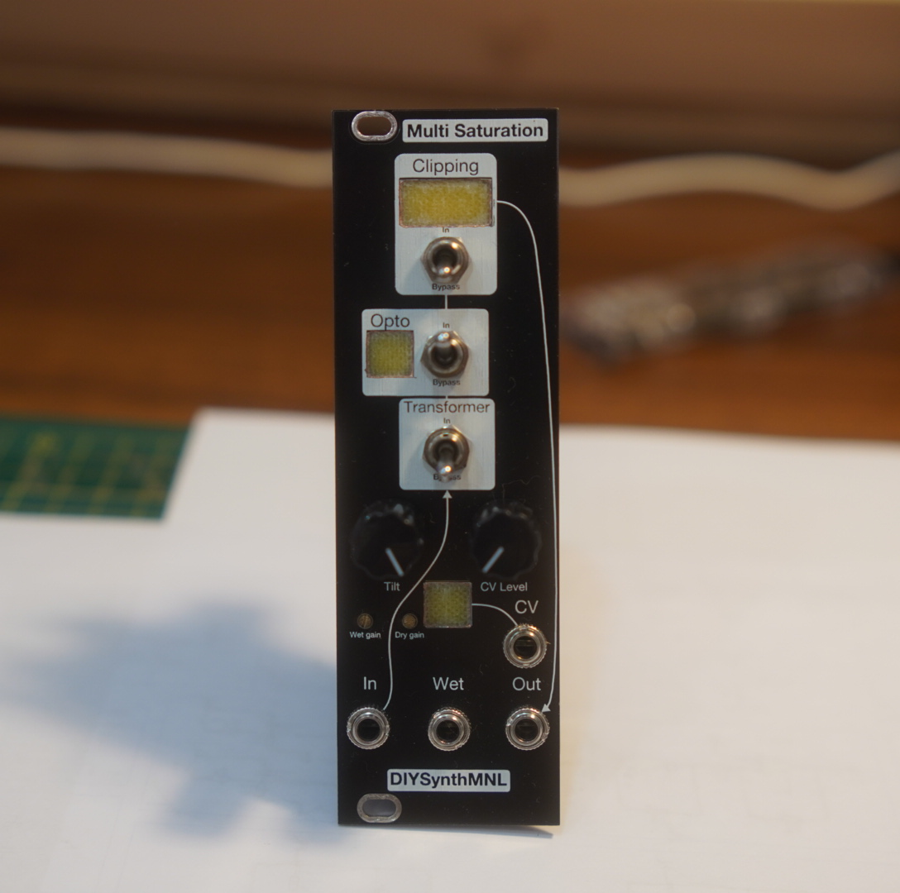 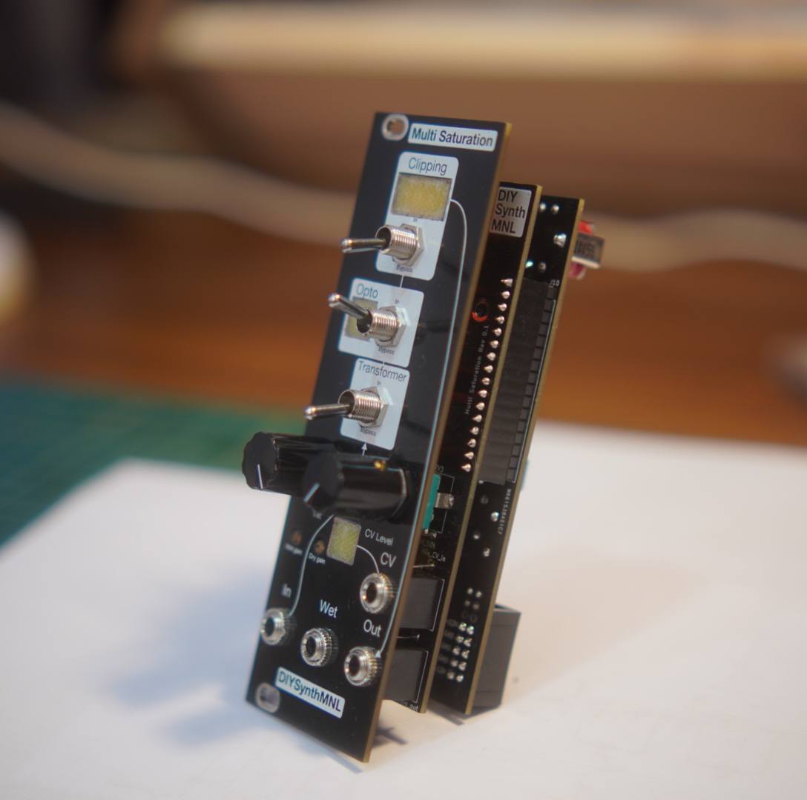

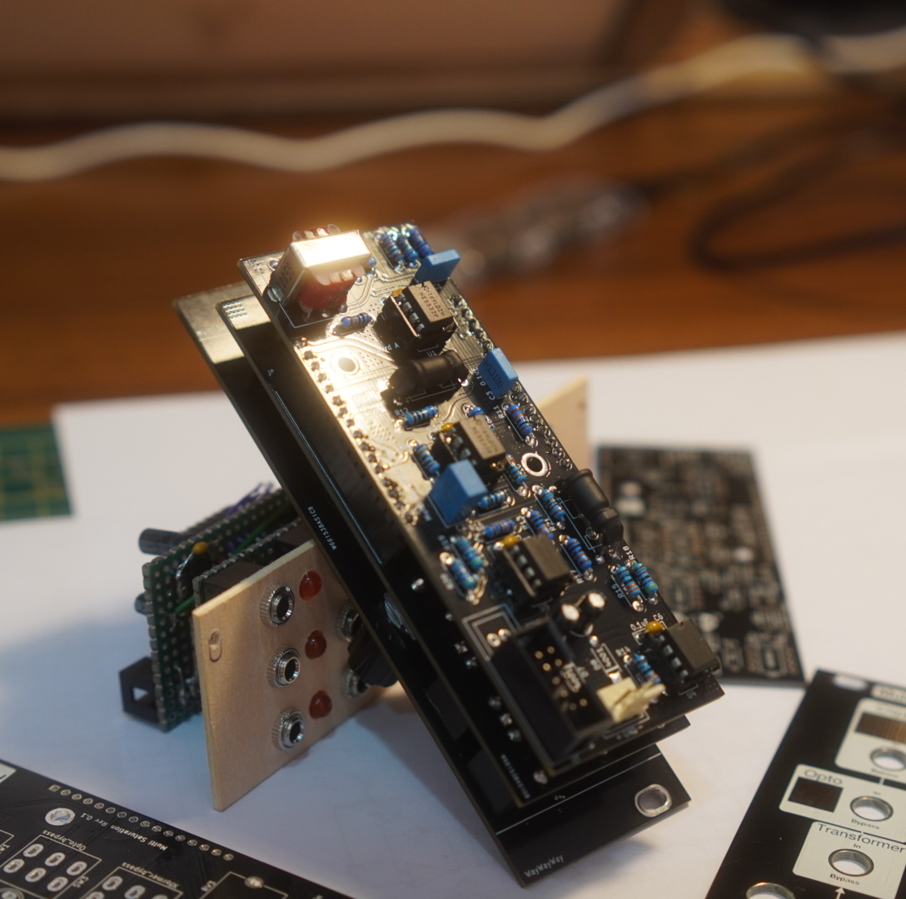 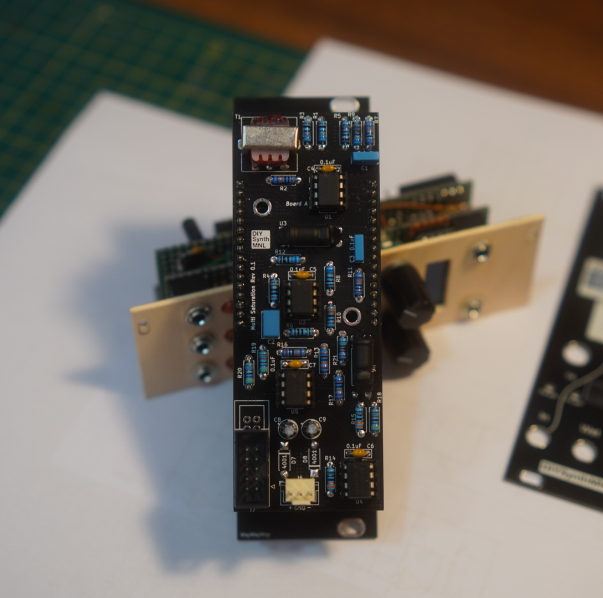 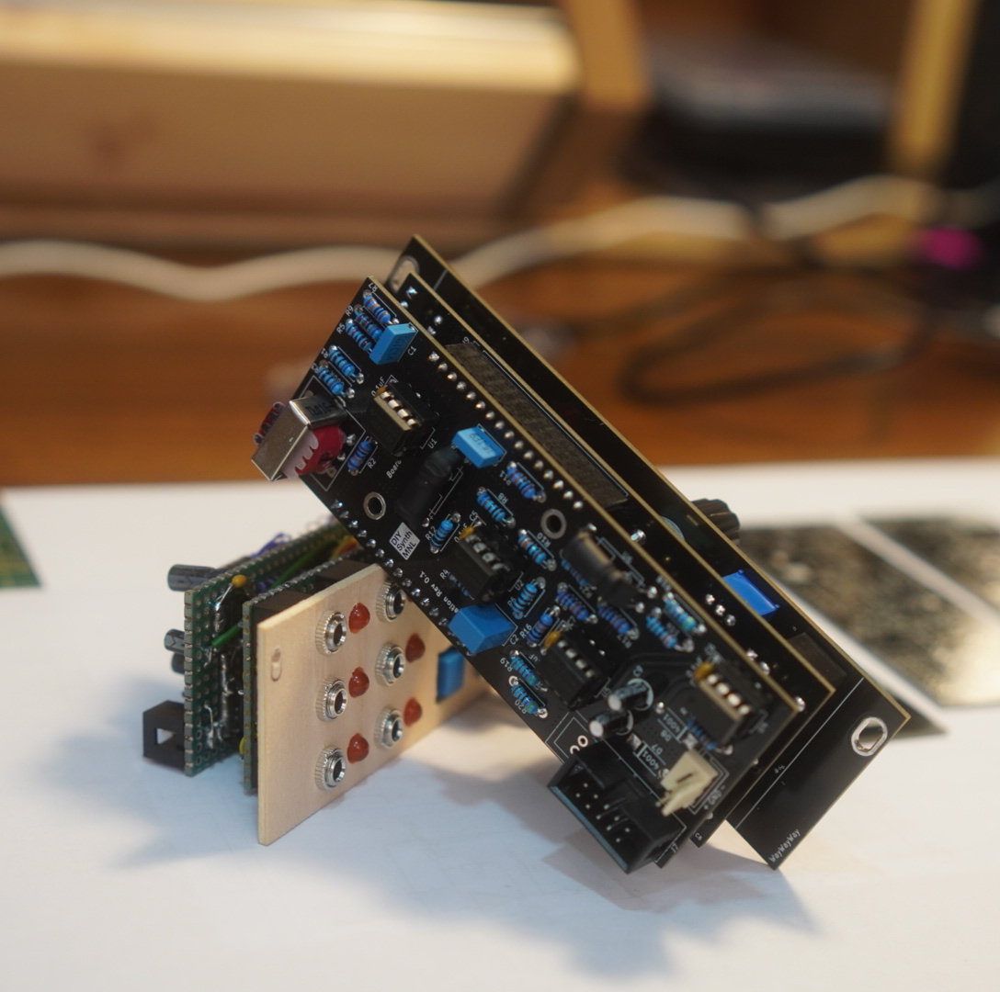

## Some background

I’m designing a distortion/saturation modular synth module using different methods of distorting audio signals.
This module is a combination of transformer, opto, and clipping distortion/saturation.

## Revision Summary

- Schematic Revision 0.5 - an easier to read schematic - please note that there are some errors in this. The Eurorack power connector pins are backwards. Use this as a reference for the circuit design.
- Schematic Revision 0.6 - multiboard layout (LATEST - working on circuit revisions)
- PCB Revision 0.1 - revising in progress (working on rev 0.2)

## Source of inspiration

### DIYRe’s Colour Modules

I got some ideas from DIYRe's Colour modules. DIYRe is a company that produces DIY kits for professional audio recording equipment. Some of their product offerings include recording studio rackmount effects.

> The Colour Format  
> Real analog plugins.  
> [https://www.diyrecordingequipment.com/pages/the-colour-format](https://www.diyrecordingequipment.com/pages/the-colour-format)  
  
|   |   |   |   |   |
|---|---|---|---|---|
|Colour Module|What does it do?|What ideas did you get?|Link to page|Schematic|
|CTX Transformer Colour|A transformer saturation module with a discrete opamp and a Cinemag audio transformer which has a 1:1 turns ratio.|Non-inverting amp to drive the transformer past what it can handle. Resistor before the transformer that isolates the opamp from the transformer.|[https://www.diyrecordingequipment.com/products/ctx-cinemag-transformer-colour-mkii](https://www.diyrecordingequipment.com/products/ctx-cinemag-transformer-colour-mkii)|[https://cdn.shopify.com/s/files/1/0698/2265/files/CTX_mkII_Schematic.pdf?375](https://cdn.shopify.com/s/files/1/0698/2265/files/CTX_mkII_Schematic.pdf?375)|
|Colourphone|A telephone sound emulator. It uses a bandpass filter and a 1:1 turn ratio audio transformer.|I have a similar transformer which is a 600:600 ohm transformer. Resistor before the transformer that isolates it from the opamp.|[https://www.diyrecordingequipment.com/products/colourphone-telephone-distortion-colour](https://www.diyrecordingequipment.com/products/colourphone-telephone-distortion-colour)|[https://cdn.shopify.com/s/files/1/0698/2265/files/XQP_Colourphone_Schematic_1.3.pdf?8973696934571457842](https://cdn.shopify.com/s/files/1/0698/2265/files/XQP_Colourphone_Schematic_1.3.pdf?8973696934571457842)|
|Colourupter|An opto distortion module that is vactrol based.|Using a vactrol and the circuit around it. IC1c and IC1d only.|[https://www.diyrecordingequipment.com/products/colourupter](https://www.diyrecordingequipment.com/products/colourupter)|[https://cdn.shopify.com/s/files/1/0698/2265/files/XQP_Colourupter_Schematic_1.7.pdf?13355729951948932441](https://cdn.shopify.com/s/files/1/0698/2265/files/XQP_Colourupter_Schematic_1.7.pdf?13355729951948932441)|

### Other sources

- Vactrol wet/dry mix from music thing modular’s spring reverb module
  - [https://www.musicthing.co.uk/Spring-Reverb/](https://www.musicthing.co.uk/Spring-Reverb/)
- Eliot Sound Products [https://sound-au.com](https://sound-au.com/) - is a website full of audio articles that I’ve learned from. Go search for these articles, they’re great!
  - Designing With Op Amps
  - Audio Transformers
  - Soft Clipping

## Circuit Design

- I will update this section soon.

### Stages

1. Input gain stage (buffer only, see design note below)

    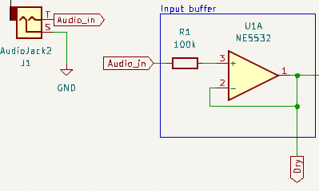

    We must take into account the headroom of the op amp. The NE5532 can only output 2 volts less than the supply voltage. So for example, your supply voltage would be +/- 12V, your max output would be 10V based on the image below.

    

    A buffer would suffice as the input stage. It would be nice to give the transformer more voltage but we wouldn’t be able to amplify the 10Vpp input to 12Vpp unless we use a +/- 15V supply.

    I chose to use an NE5532 Op Amp because I believe it can drive outputs higher than TL07x.

2. Transformer Saturation

    The transformer distortion works by oversaturating the transformer’s core past what it can handle. The transformer I used would normally be used in line audio signals. A 600:600 ohm transformer. We’re using Eurorack voltage which is around 10vpp so that would oversaturate the transformer.

    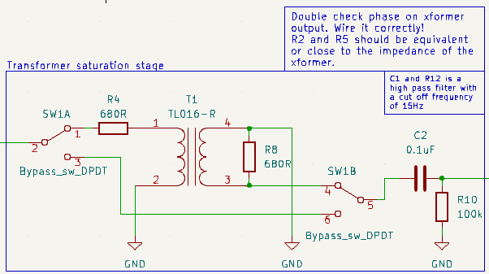

3. Vactrol Opto Electronic Saturation

    The transformer’s output was low, I needed to add a non-inverting op amp with gain to bring the levels back to 10vpp for this stage.

    I got this circuit from DIYRe’s Colourupter colour module which uses a Vactrol to clip the signal.

    

4. Soft Clipping Diode Saturation

    I chose to place these diodes after the wet amplifier. It would be softer if I placed it before the U4A. I chained LEDs to the 1N4148s to get a softer clipping effect. LEDs alone would make saw waves looking like square waves.

    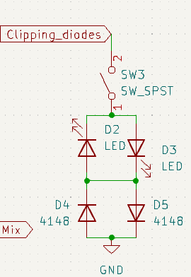

5. Voltage controlled Vactrol Wet/Dry mix

    I used my handmade Vactrol. I made it using a 5mm diffused red LED and a 5mm LDR enclosed with black heat shrink tubing. I crimped the ends so no light would leak in. 47k works for R17 with my Vactrol.

    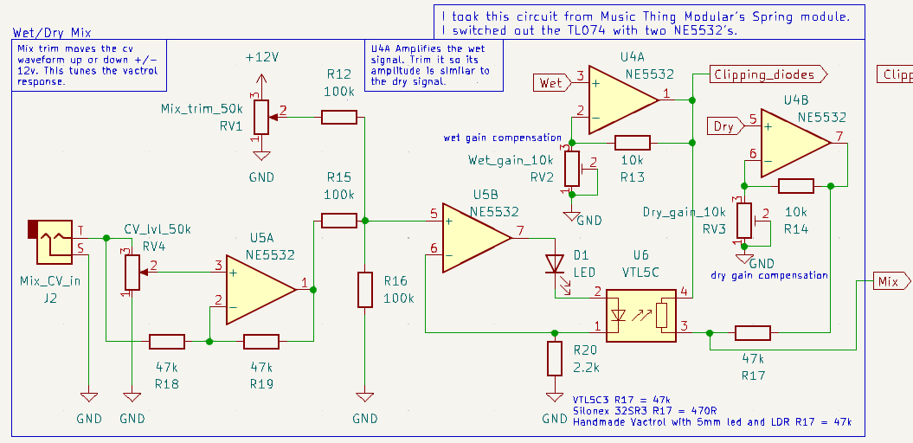

### Schematic Revisions

- Revision 0.2
  - TODO
    - [x] Replace R5 with trimmer
    - [x] Test wet/dry mix on breadboard
    - [x] Input buffer biasing resistor
  - Notes
    - The transformer saturation is very subtle on a mono synth
- Revision 0.3

  - TODO

  - [x] Add gain trimmer to dry signal at U2B
  - [x] Scrap the single saturation and add diode clipping and the Colourupter, the transformer alone is too subtle
  - [x] Test output gain stage
- Revision 0.4
  - [x] Scrap output auto gain
  - [x] add opto saturation
  - [x] add soft clipping diodes
- Revision 0.5
  - [x] Multiboard layout
- Revision 0.6
  - [ ] Fix amplitude difference on opto sat stage output.

## PCB Design

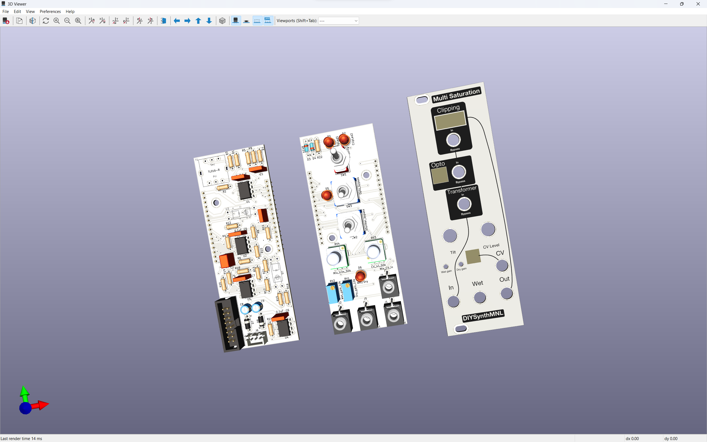

Dec 27, 2023 - Almost satisfied with the board design, rev0.1

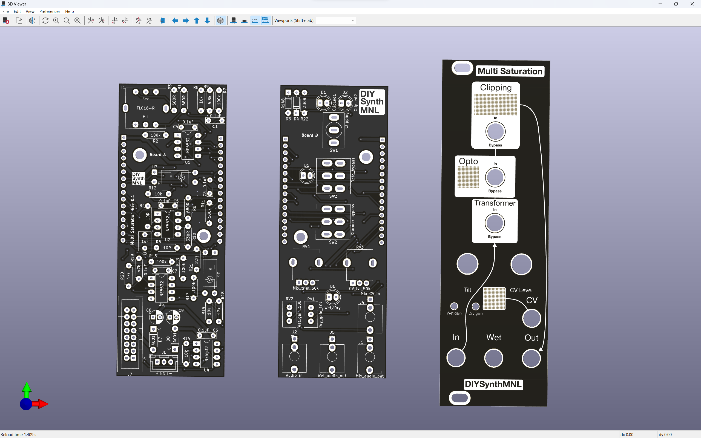

Rev 0.1 in black

### PCB revisions

- Todo for Revision 0.1
  - [x] Ground plane vias
  - [x] Front panel ground plane
  - [x] Double check hole sizes
    - [x] Trimmer
  - [x] Double check via sizes
  - [x] Round tracks
- Todo for Revision 0.2
  - Front panel
    - [x] Add keep out zone for led window zone fills for FCU and BCU - I had to Dremel it out for the revision 0.1 front panel board
    - [x] Enlarge switch holes for Dailywell switches
    - [x] Enlarge trimmer holes
    - [x] Change tilt knob silkscreen to “mix”
    - [ ] Fix amplitude difference on opto sat output. The opto stage attenuates the signal from the transformer too much
- Revision 0.1 Board test notes
  - Voltage tests
    - Power rails after reverse protection diode I used a 1N4007 diode
      - V+ reads about 10V
      - V- reads about 11V
      - I might need to change the reverse protection diodes to Schottkys
  - Music thing modular’s cv wet dry circuit has an optimal input of 0-5V control voltages. If 10Vpp was used, the middle of the cv level pot is zero. Fully clockwise, the cv would be in phase. Fully counter clockwise, the cv is inverted. This is simulated in falstad, the file is included in the falstad folder.
  - Gain trim is finicky. Turning on the Opto would attenuate the signal. Maybe this is caused by the variety of the vactrol, I think not all vactrols are equal. Opto gain/amplitude trim might be required. It might be a simple resistor value change within the circuit.
  - LEDs are not as bright as I want them.
