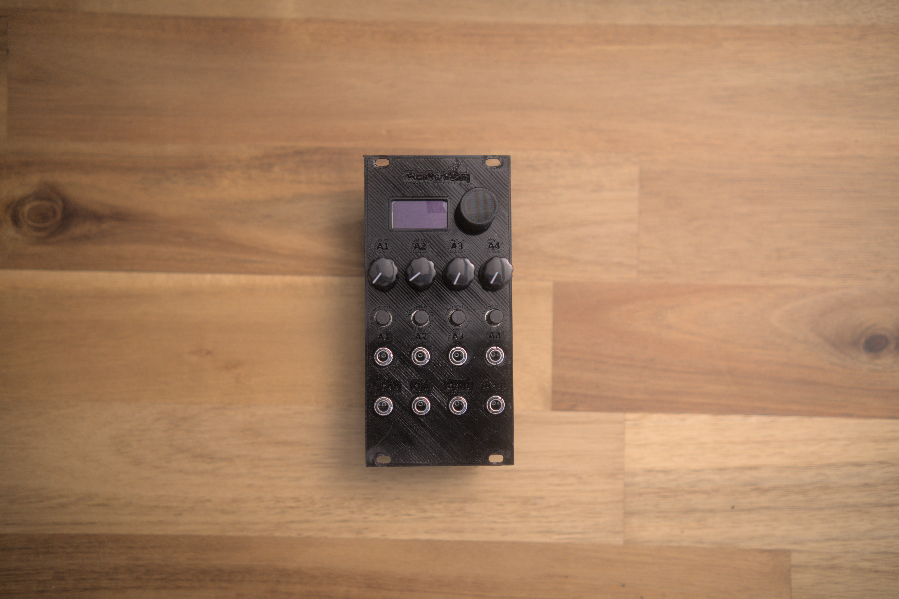
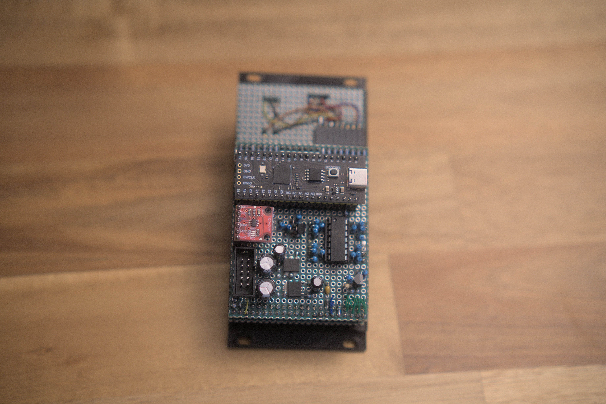
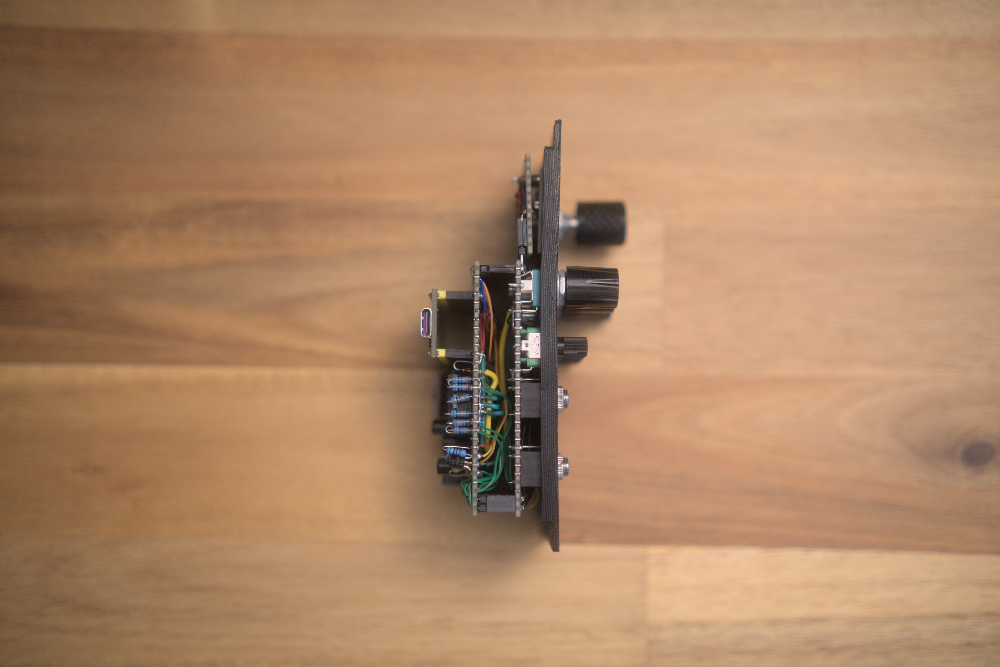
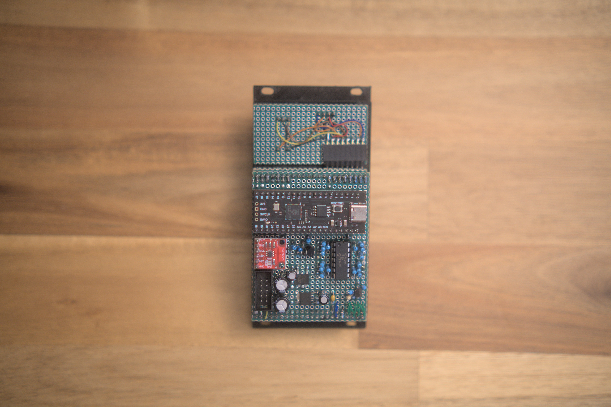
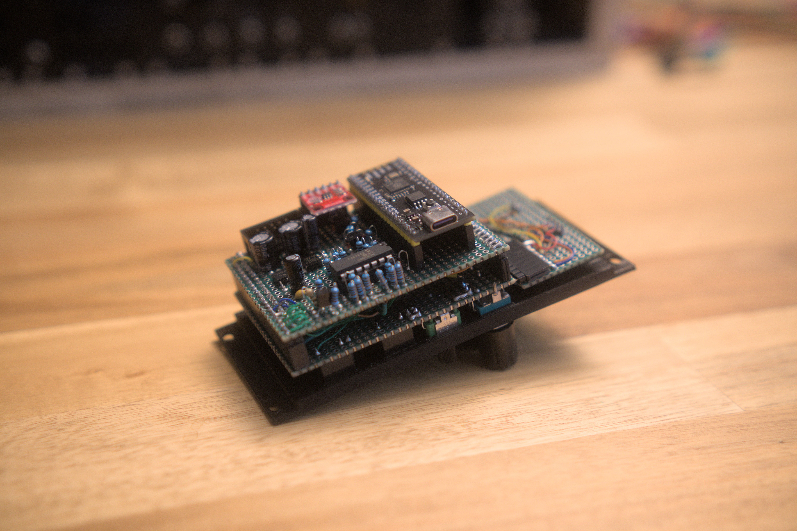

This module is licensed under the [MIT License](https://opensource.org/licenses/MIT)

[Module GitHub link](https://github.com/DIYSynthMNL/Pi-Pico-Random-Looping-Sequencer)

## A random control voltage and trigger/gate sequencer Eurorack module

This module is a random CV and trigger/gate sequencer with a built in quantizer with predefined scales. An upgrade from my [first random sequencer module](https://github.com/NeoRecasata/RandomLoopingSequencer).

Built with the Pi Pico. Coded in Python.

   

## Inspiration

I've taken some inspiration from the popular random module called the Turing Machine.
Also, I've taken some code from the [EuroPi](https://github.com/Allen-Synthesis/EuroPi), specifically the analog reader for the CV inputs and knobs.

## TODO

- [x] Prototype
- [ ] Schematic
- [ ] CV input code
- [x] Random triggers
- [ ] A better menu system
- [ ] Better logic, moving the rotary encoder while its running will make the sequencer glitch

## Features

### Basic features

- 128x64 oled screen
- Rotary Encoder
- A random cv sequencer
- A random trigger/gate sequencer
- Output cv quantized based on scale chosen
- 4 Analog parameter knobs with inputs

### Menu system

I cobbled up some code to help me make a menu system for this project. Its still in the early stages of development. I still need to clean it up.
You can take a look at my `menu.py` code in the GitHub repo for this project.

#### How the menu system works

SETTING SUBMENUS:

First, you would have to create instances of submenus in your main program.
Then you can put those instances in a list called `submenu_list`.
Lastly, call the `set_submenus()`.

MAKING THE DISPLAY AND ENCODER DO ITS JOB:

Call `loop_main_menu(update_main_program_values_callback=[callback_function])` in a while True loop.
The callback function is for updating the variables used in your main program. It is discussed more in detail below.

GETTING DATA FROM THE MENU SYSTEM INTO YOUR MAIN PROGRAM:

This library only handles the "front end" of your main python program, handling user interaction with the display and the rotary encoder.
It is designed to hold data but you should have variables in your main program so you can access the data easily.
For example, you need to get data from a submenu: you would need to call `get_submenu_list()` in order to update the main program's variables.
To help you update your main program's variables from the submenus, you will need to provide a callback function in your main program (example: `update_values()`).
This callback function will only be called when a submenu's selected value has been changed (user pressed the encoder button).

## IO

- 4 Analog knobs with tied inputs with input level knobs
- Trig in
- Digital input
- Digital output
- Analog CV output

## Starting fresh (Preparing the pico for the firmware)

1. Download [flash_nuke.uf2](https://learn.adafruit.com/getting-started-with-raspberry-pi-pico-circuitpython/circuitpython#flash-resetting-uf2-3083182) from Adafruit.
2. While holding down the BOOTSEL button on the Pi Pico, connect the usb cable to your computer.
3. It should be visible as a USB drive as RPI-RP2. Copy the downloaded `flash_nuke.uf2` into it. This will wipe any firmware in the Pico. Be sure to backup any files in your Pico.

## Development instructions

- Turn on the module (eurorack power)
- Plug in the usb to the pico (yes it won't damage the pico)

### Developing with VSCode

Use VSCode with the plugin MicroPico

Use the commands while developing:

- Delete all files from pico
- Upload project files to pico
- Run

## MCP 4725 lookup table

The optimal lowest voltage should not be 0. The MCP4725 cannot output exactly 0v for some reason. Your tuning will not be exact when the value is 0.

| note no | 12 bit value | voltage output | keyboard note (example only) |
| ------- | ------------ | -------------- | ---------------------------- |
| 0       | 0            | 0              | C                            |
| 1       | 68           | 0.0830078125   | C#                           |
| 2       | 136          | 0.166015625    | D                            |
| 3       | 204          | 0.2490234375   | D#                           |
| 4       | 272          | 0.33203125     | E                            |
| 5       | 340          | 0.4150390625   | F                            |
| 6       | 408          | 0.498046875    | F#                           |
| 7       | 476          | 0.5810546875   | G                            |
| 8       | 544          | 0.6640625      | G#                           |
| 9       | 612          | 0.7470703125   | A                            |
| 10      | 680          | 0.830078125    | A#                           |
| 11      | 748          | 0.9130859375   | B                            |
| 12      | 816          | 0.99609375     | C                            |
| 13      | 884          | 1.079101563    | C#                           |
| 14      | 952          | 1.162109375    | D                            |
| 15      | 1020         | 1.245117188    | D#                           |
| 16      | 1088         | 1.328125       | E                            |
| 17      | 1156         | 1.411132813    | F                            |
| 18      | 1224         | 1.494140625    | F#                           |
| 19      | 1292         | 1.577148438    | G                            |
| 20      | 1360         | 1.66015625     | G#                           |
| 21      | 1428         | 1.743164063    | A                            |
| 22      | 1496         | 1.826171875    | A#                           |
| 23      | 1564         | 1.909179688    | B                            |
| 24      | 1632         | 1.9921875      | C                            |
| 25      | 1700         | 2.075195313    | C#                           |
| 26      | 1768         | 2.158203125    | D                            |
| 27      | 1836         | 2.241210938    | D#                           |
| 28      | 1904         | 2.32421875     | E                            |
| 29      | 1972         | 2.407226563    | F                            |
| 30      | 2040         | 2.490234375    | F#                           |
| 31      | 2108         | 2.573242188    | G                            |
| 32      | 2176         | 2.65625        | G#                           |
| 33      | 2244         | 2.739257813    | A                            |
| 34      | 2312         | 2.822265625    | A#                           |
| 35      | 2380         | 2.905273438    | B                            |
| 36      | 2448         | 2.98828125     | C                            |
| 37      | 2516         | 3.071289063    | C#                           |
| 38      | 2584         | 3.154296875    | D                            |
| 39      | 2652         | 3.237304688    | D#                           |
| 40      | 2720         | 3.3203125      | E                            |
| 41      | 2788         | 3.403320313    | F                            |
| 42      | 2856         | 3.486328125    | F#                           |
| 43      | 2924         | 3.569335938    | G                            |
| 44      | 2992         | 3.65234375     | G#                           |
| 45      | 3060         | 3.735351563    | A                            |
| 46      | 3128         | 3.818359375    | A#                           |
| 47      | 3196         | 3.901367188    | B                            |
| 48      | 3264         | 3.984375       | C                            |
| 49      | 3332         | 4.067382813    | C#                           |
| 50      | 3400         | 4.150390625    | D                            |
| 51      | 3468         | 4.233398438    | D#                           |
| 52      | 3536         | 4.31640625     | E                            |
| 53      | 3604         | 4.399414063    | F                            |
| 54      | 3672         | 4.482421875    | F#                           |
| 55      | 3740         | 4.565429688    | G                            |
| 56      | 3808         | 4.6484375      | G#                           |
| 57      | 3876         | 4.731445313    | A                            |
| 58      | 3944         | 4.814453125    | A#                           |
| 59      | 4012         | 4.897460938    | B                            |
| 60      | 4080         | 4.98046875     | C                            |
