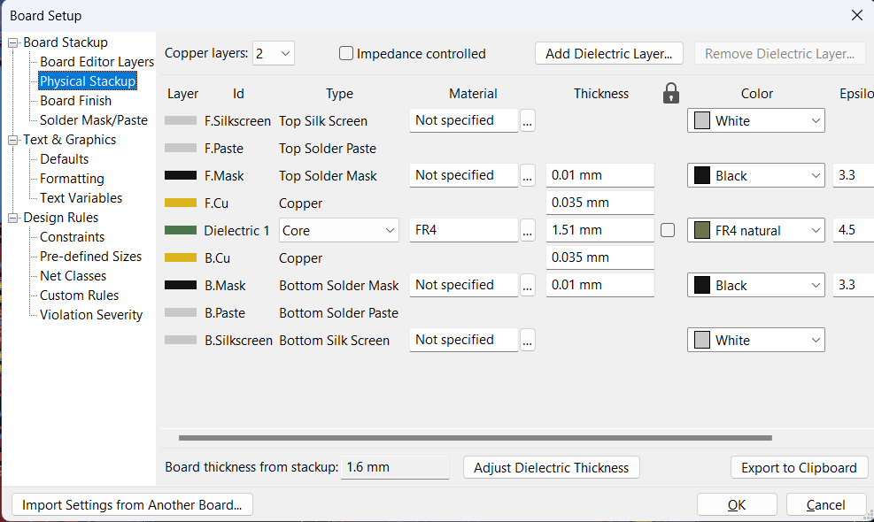
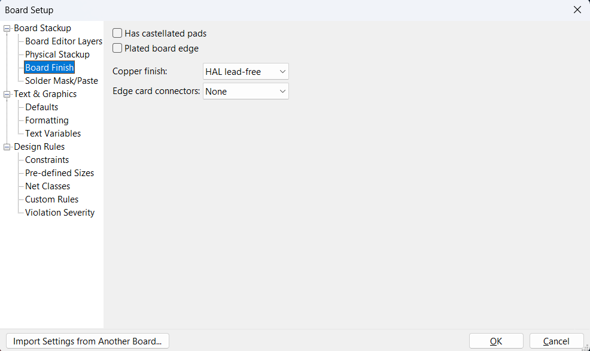
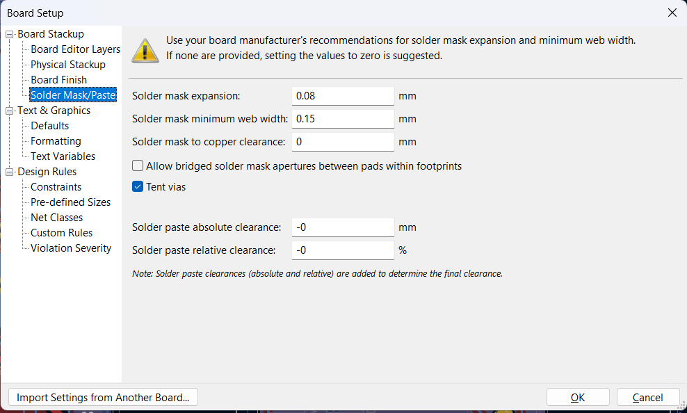
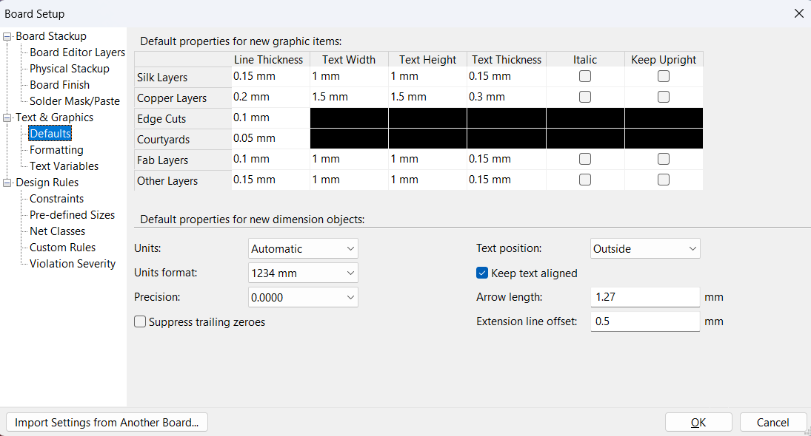
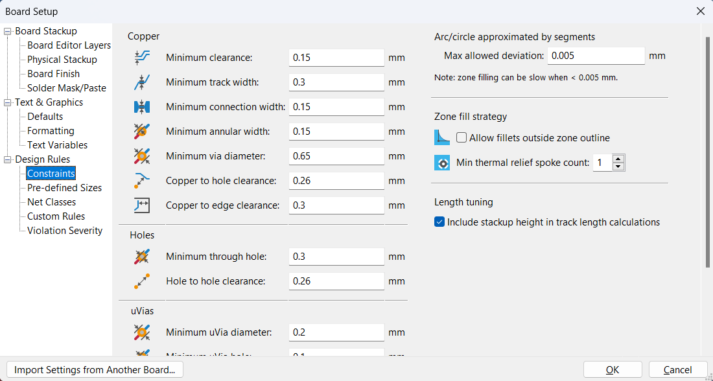
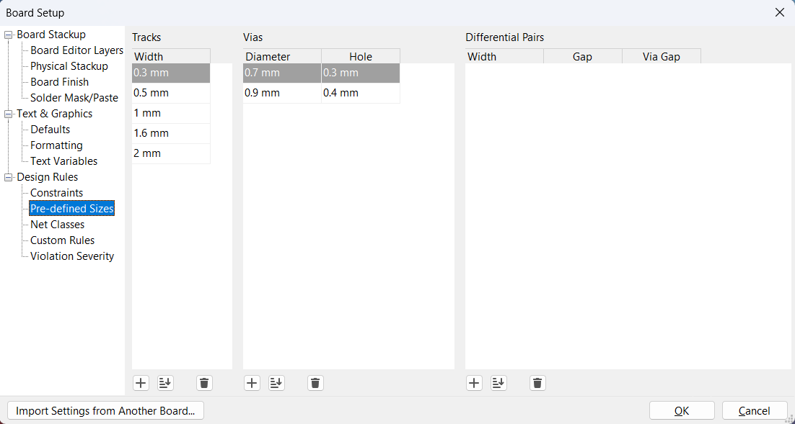

## Board Stackup - Physical stackup

## Board Stackup - Board Finish

## Board Stackup - Solder Mask/Paste

## Text & Graphics - Defaults

## Design Rules - Constraints

## Design Rules - Pre-defined Sizes

