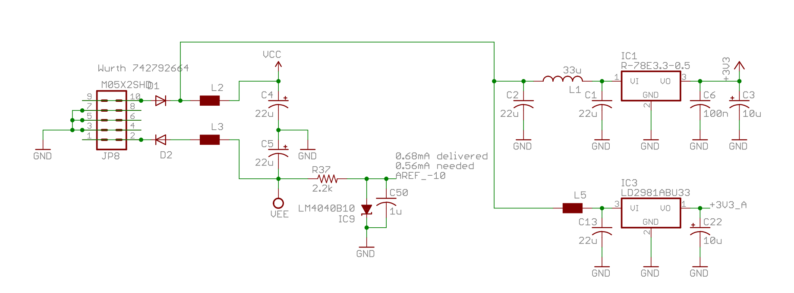
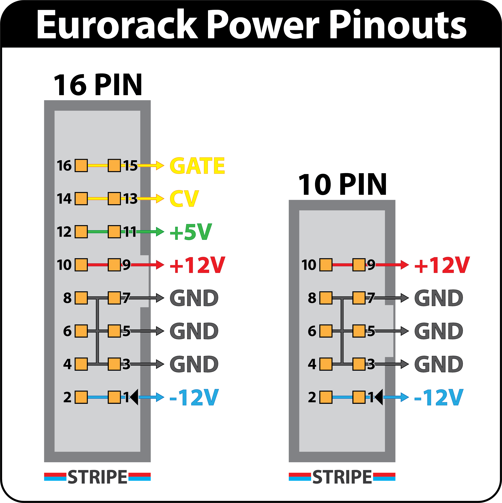

## The basic components of a power input circuit in a module

The circuit above is from a Mutable Instruments module.

- IDC input
- Reverse polarity protection
- Filter caps

## The Eurorack standard power connector

