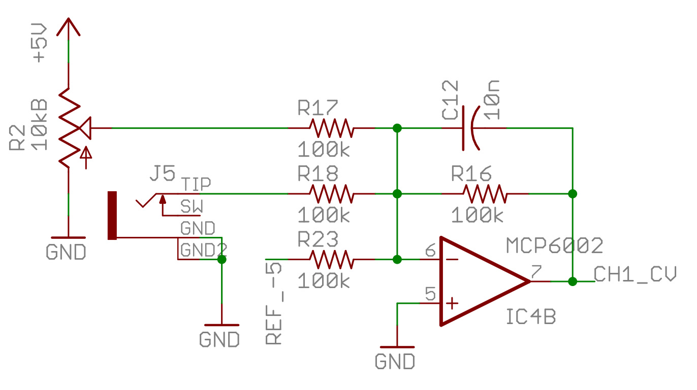
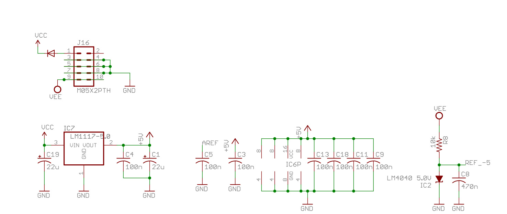
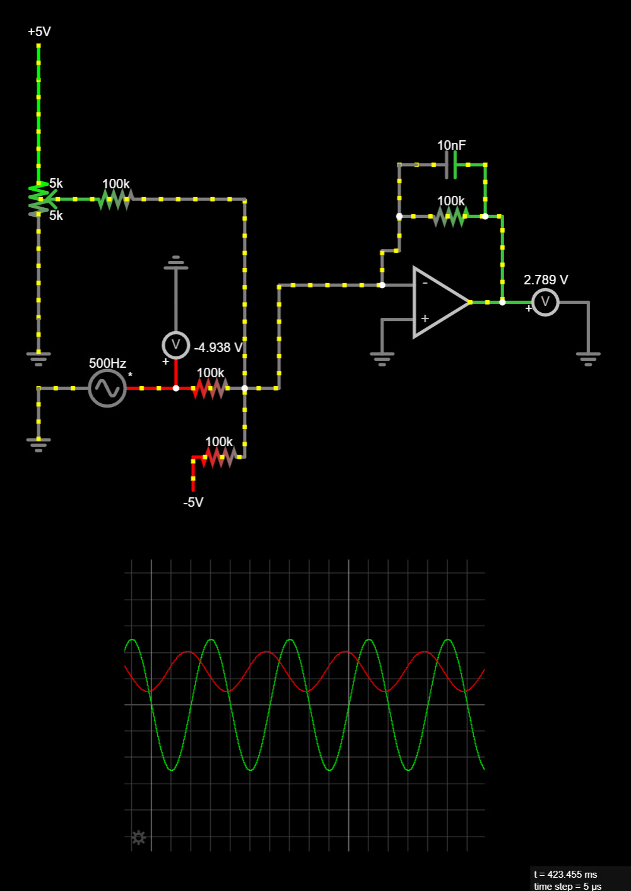
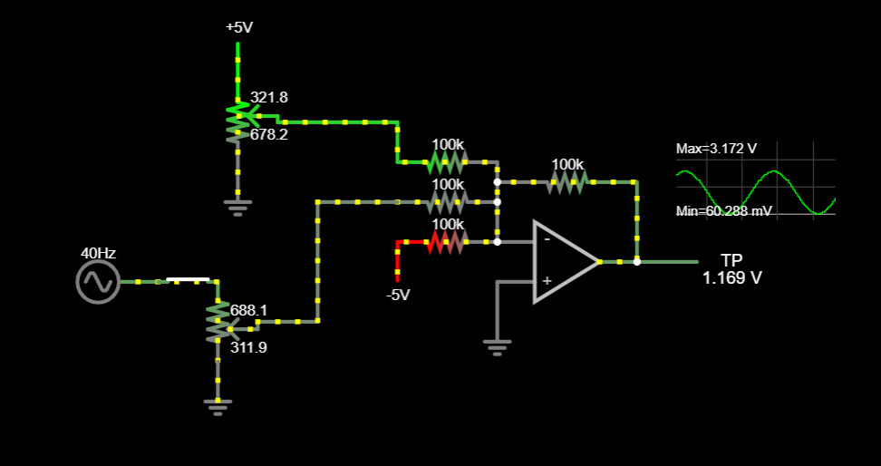
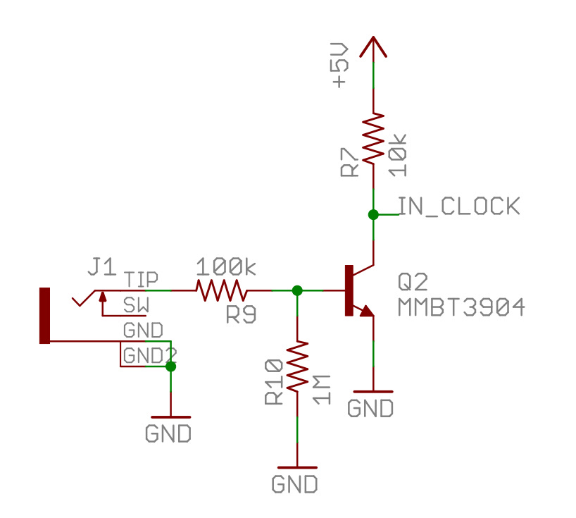
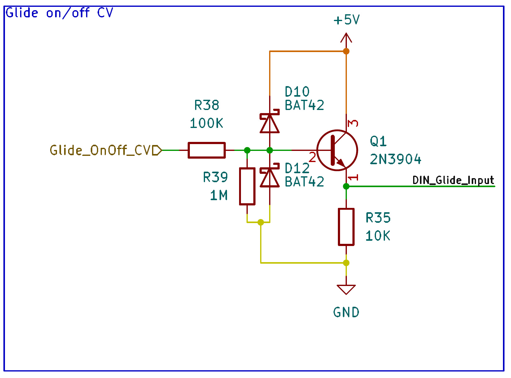

Here are some circuits to help protect your precious microcontroller's inputs.

## Protecting microcontroller analog inputs

### Using Mutable Instruments’ Grids as our first example

- You will need a rail to rail op amp. A popular choice would be an MCP6002 chip.
- The op amp would be powered by 5v and ground **(not +-12V!)**. This will "clamp" the cv signal.
- The output of the op amp connects to an analog input of a microcontroller.
- You would need a negative reference voltage source. Grids used a Zener diode. VEE is -12v.
- I usually use a 7905 -5v negative voltage regulator for the reference voltage.
- **This is an inverting op amp circuit, you would need to adjust your code to accept inverted values**

### Adding an input amplitude knob

Adding an input amplitude knob to the Grids circuit would help us accept a wide range of signals in combination with the offset knob. 0-5v, 0-10v, and +-5v.

## Protecting microcontroller digital inputs

- It uses an NPN transistor with a pullup resistor
- **Note that the Arduino pin will be low when the gate is high, code with this in mind.**
- It connects directly to a digital input pin of the Arduino
- To protect your inputs more, you could add clamping diodes to the base of the transistor like below
- The bat42 Schottky diode is commonly used for this purpose

> Disclaimer: The information provided in this blog is based on my personal experience and knowledge. I am not formally educated in electronics design, and any design or information should be undertaken at your own risk. It is always recommended to consult with a qualified professional or conduct thorough research before attempting any electronics project. I do not guarantee the accuracy, completeness, or reliability of the information presented on this blog. By using this blog, you agree that I shall not be held responsible for any damages or losses that may arise from your use of the information provided.
