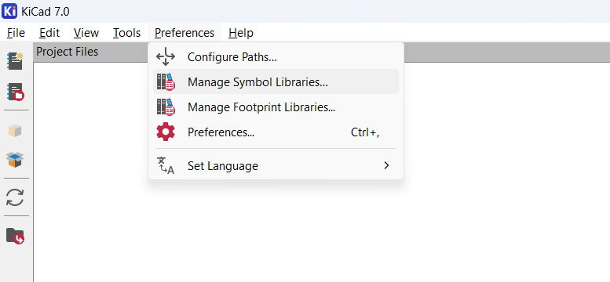
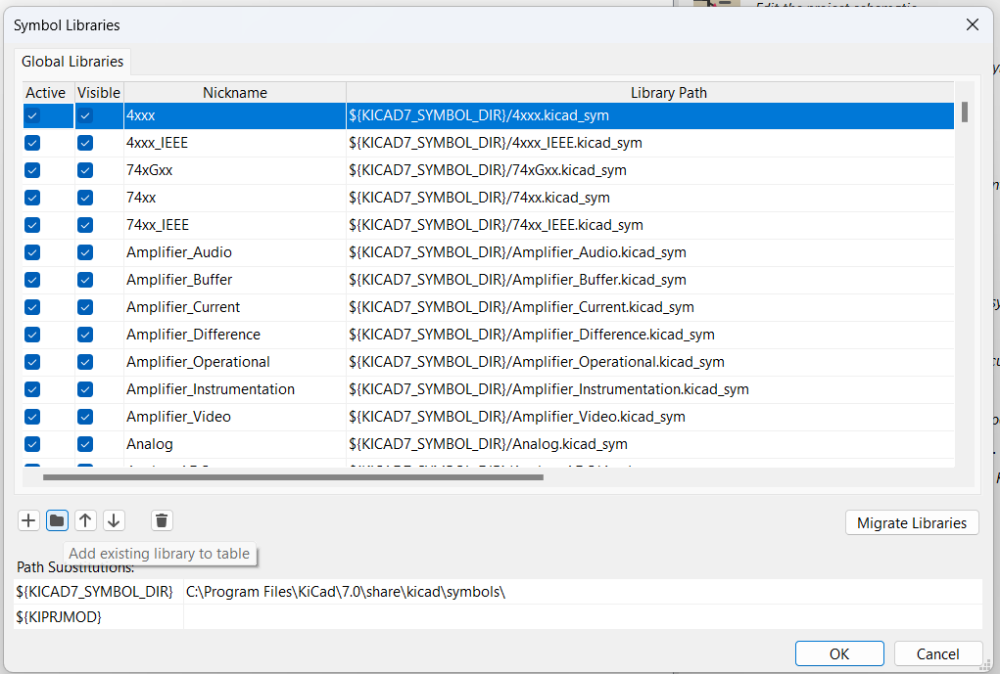
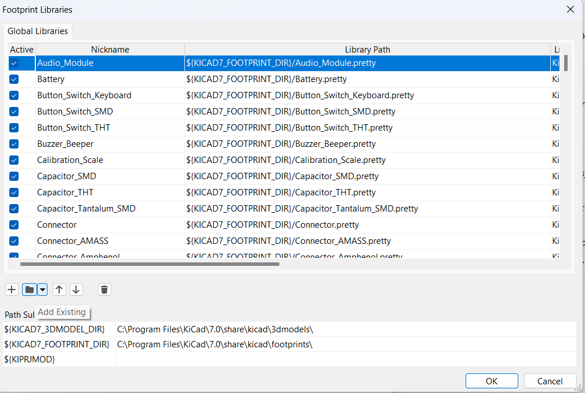

## Adding Libraries

### Symbol Libraries

- Make sure you put the library in a folder that you would not delete. Not in your downloads folder.
- Click add existing library to table

- Browse to your `.sym` or `.lib` file within your folder and click ok

### Footprint Libraries

- Make sure you put the library in a folder that you would not delete. Not in your downloads folder.
- Click add existing library to table

- Browse to your .pretty folder and select it. Then click ok.

## Adding footprints

To be continued...
